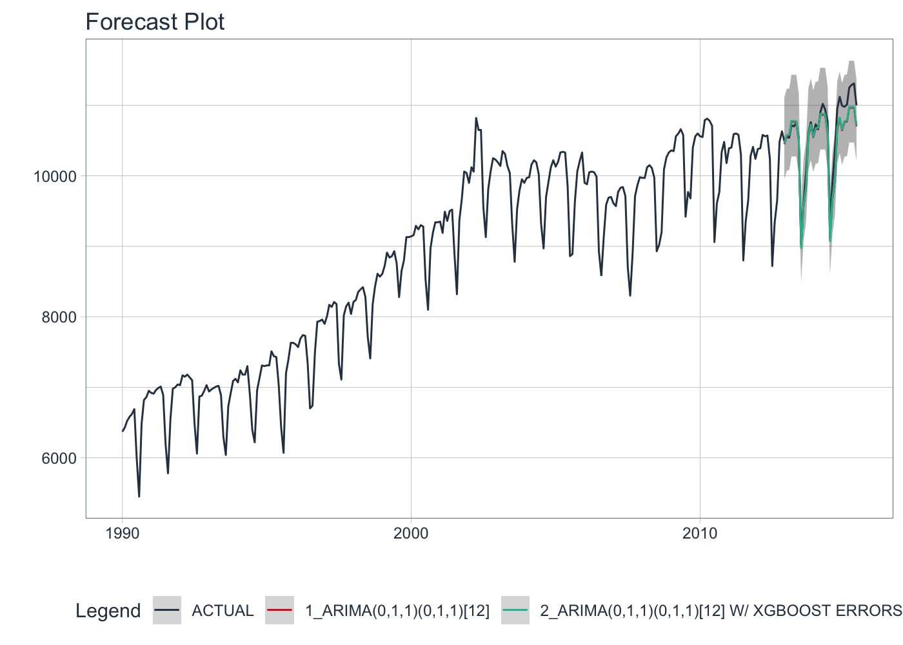
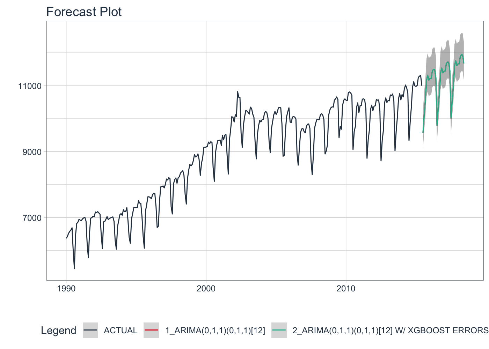

<!-- README.md is generated from README.Rmd. Please edit that file -->

# modeltime

<!-- badges: start -->

<!-- badges: end -->

A scalable time series forecasting framework and workflow for use with
the `tidymodels` ecosystem.

## Features & Benefits

Modeltime has a few key features and benefits:

1.  **Interactive Plotting by default** - Modeling algorithms have
    strengths and weaknesses that come to light when visualized
    interactively.
2.  **Use Classical Algorithms and Machine Learning Algorithms
    together** - No need to switch back and forth between various
    frameworks. `modeltime` unlocks machine learning & classical time
    series analysis.

## ARIMA Example

Load libraries.

``` r
library(modeltime)
library(tidyverse)
library(lubridate)
library(timetk)
library(parsnip)
library(rsample)
```

### Step 1 - Collect data and split into training and test sets.

``` r
# Data
m750 <- m4_monthly %>% filter(id == "M750")

# Split Data 80/20
splits <- initial_time_split(m750, prop = 0.9)
```

### Step 2 - Fit Models

Fit ARIMA models to a training set. We have included some classic time
series models and some new boosted versions:

  - **Auto ARIMA** (see `arima_reg()`)
  - **Auto ARIMA + XGBoost** - XGBoosted ARIMA Errors\! (see
    `arima_boost()`)

<!-- end list -->

``` r
# Model 1: auto_arima ----
model_fit_no_boost <- arima_reg() %>%
    set_engine(engine = "auto_arima") %>%
    fit(value ~ date, data = training(splits))

# Model 2: arima_boost ----
model_fit_boosted <- arima_boost(
    min_n = 2,
    learn_rate = 0.015
) %>%
    set_engine(engine = "auto_arima_xgboost") %>%
    fit(value ~ date + as.numeric(date) + month(date, label = TRUE),
        data = training(splits))
```

### Step 3 - Add fitted models to a Model Table.

Add as many models as you’d like. The analysis scales with multiple
models.

``` r
models_tbl <- modeltime_table(
    model_fit_no_boost,
    model_fit_boosted
)

models_tbl
#> # Modeltime Table
#> # A tibble: 2 x 3
#>   .model_id .model   .model_desc                              
#>       <int> <list>   <chr>                                    
#> 1         1 <fit[+]> ARIMA(0,1,1)(0,1,1)[12]                  
#> 2         2 <fit[+]> ARIMA(0,1,1)(0,1,1)[12] W/ XGBOOST ERRORS
```

### Step 4 - Calibrate the model to a training set.

Calibrating adds a new column, `.calibration_data`, with the test
predictions and residuals inside. This is how confidence intervals and
accuracy metrics are determined from out-of-sample predictions.

``` r
calibration_tbl <- models_tbl %>%
    modeltime_calibrate(new_data = testing(splits))

calibration_tbl
#> # Modeltime Table
#> # A tibble: 2 x 5
#>   .model_id .model   .model_desc                          .type .calibration_da…
#>       <int> <list>   <chr>                                <chr> <list>          
#> 1         1 <fit[+]> ARIMA(0,1,1)(0,1,1)[12]              Test  <tibble [31 × 4…
#> 2         2 <fit[+]> ARIMA(0,1,1)(0,1,1)[12] W/ XGBOOST … Test  <tibble [31 × 4…
```

### Step 5 - Forecast vs Testing Set

Visualizing the Test Error is easy to do. And you get an out-of-sample
confidence interval.

``` r
calibration_tbl %>%
    modeltime_forecast(
        new_data    = testing(splits),
        actual_data = m750
    ) %>%
    plot_modeltime_forecast(.interactive = FALSE)
```



### Step 6 - Refit to Full Dataset & Forecast Forward

``` r
refit_tbl <- calibration_tbl %>%
    modeltime_refit(data = m750)

refit_tbl %>%
    modeltime_forecast(h = "3 years", actual_data = m750) %>%
    plot_modeltime_forecast(.interactive = FALSE)
```



## Installation

Install the development version from with:

``` r
# install.packages("devtools")
devtools::install_github("business-science/modeltime")
```

# Learning More

I teach `modeltime` in my **Time Series Analysis & Forecasting Course**.
If interested in learning Pro-Forecasting Strategies then [join my
waitlist](https://mailchi.mp/business-science/time-series-forecasting-course-coming-soon).
The course is coming soon.


You will learn:

  - Time Series Preprocessing, Noise Reduction, & Anomaly Detection
  - Feature engineering using lagged variables & external regressors
  - Hyperparameter Tuning
  - Time series cross-validation
  - Ensembling Multiple Machine Learning & Univariate Modeling
    Techniques (Competition Winner)
  - NEW - Deep Learning with RNNs (Competition Winner)
  - and more.

<p class="text-center" style="font-size:30px;">

<a href="https://mailchi.mp/business-science/time-series-forecasting-course-coming-soon">Signup
for the Time Series Course waitlist</a>

</p>
