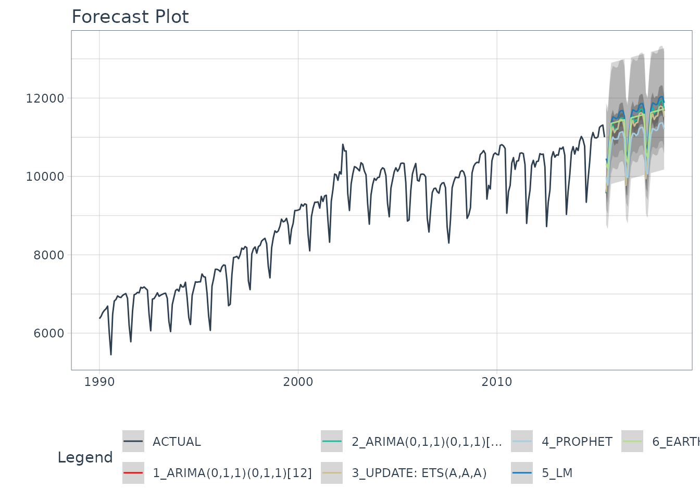

# Getting Started with Modeltime

  


Forecasting with `tidymodels` made easy! This short tutorial shows how
you can use:

- **Modeltime models** like
  [`arima_reg()`](https://business-science.github.io/modeltime/reference/arima_reg.md),
  [`arima_boost()`](https://business-science.github.io/modeltime/reference/arima_boost.md),
  [`exp_smoothing()`](https://business-science.github.io/modeltime/reference/exp_smoothing.md),
  [`prophet_reg()`](https://business-science.github.io/modeltime/reference/prophet_reg.md),
  [`prophet_boost()`](https://business-science.github.io/modeltime/reference/prophet_boost.md),
  and more
- **Parsnip models** like
  [`linear_reg()`](https://parsnip.tidymodels.org/reference/linear_reg.html),
  [`mars()`](https://parsnip.tidymodels.org/reference/mars.html),
  [`svm_rbf()`](https://parsnip.tidymodels.org/reference/svm_rbf.html),
  [`rand_forest()`](https://parsnip.tidymodels.org/reference/rand_forest.html),
  [`boost_tree()`](https://parsnip.tidymodels.org/reference/boost_tree.html)
  and more

…to perform classical time series analysis and machine learning ***in
one framework!*** See [*“Model
List”*](https://business-science.github.io/modeltime/articles/modeltime-model-list.html)
for the full list of `modeltime` models.

## Quickstart Video

For those that prefer video tutorials, we have an [11-minute YouTube
Video](https://www.youtube.com/watch?v=-bCelif-ENY) that walks you
through the Modeltime Workflow.

[](https://www.youtube.com/watch?v=-bCelif-ENY)


(Click to Watch on YouTube)

## The Modeltime Workflow

Here’s the general process and where the functions fit.


The Modeltime Workflow

Just follow the `modeltime` workflow, which is detailed in 6 convenient
steps:

1.  Collect data and split into training and test sets
2.  Create & Fit Multiple Models
3.  Add fitted models to a **Model Table**
4.  **Calibrate** the models to a testing set.
5.  Perform Testing Set *Forecast* & *Accuracy* Evaluation
6.  **Refit** the models to Full Dataset & *Forecast* Forward

Let’s go through a guided tour to kick the tires on `modeltime`.

## Time Series Forecasting Example

Load libraries to complete this short tutorial.

``` r
library(xgboost)
library(tidymodels)
library(modeltime)
library(tidyverse)
library(timetk)

# This toggles plots from plotly (interactive) to ggplot (static)
interactive <- FALSE
```

### Step 1 - Collect data and split into training and test sets.

``` r
# Data
m750 <- m4_monthly %>% filter(id == "M750")
```

We can visualize the dataset.

``` r
m750 %>%
  plot_time_series(date, value, .interactive = interactive)
```


Let’s split the data into training and test sets using
[`initial_time_split()`](https://rsample.tidymodels.org/reference/initial_split.html)

``` r
# Split Data 80/20
splits <- initial_time_split(m750, prop = 0.9)
```

### Step 2 - Create & Fit Multiple Models

We can easily create dozens of forecasting models by combining
`modeltime` and `parsnip`. We can also use the `workflows` interface for
adding preprocessing! Your forecasting possibilities are endless. Let’s
get a few basic models developed:

- ARIMA
- Exponential Smoothing
- Linear Regression
- MARS (Multivariate Adaptive Regression Splines)

**Important note: Handling Date Features**

*Modeltime models*
(e.g. [`arima_reg()`](https://business-science.github.io/modeltime/reference/arima_reg.md))
are created with a date or date time feature in the model. You will see
that most models include a formula like `fit(value ~ date, data)`.

*Parsnip models*
(e.g. [`linear_reg()`](https://parsnip.tidymodels.org/reference/linear_reg.html))
typically should not have date features, but may contain derivatives of
dates (e.g. month, year, etc). You will often see formulas like
`fit(value ~ as.numeric(date) + month(date), data)`.

#### Model 1: Auto ARIMA (Modeltime)

First, we create a basic univariate ARIMA model using “Auto Arima” using
[`arima_reg()`](https://business-science.github.io/modeltime/reference/arima_reg.md)

``` r
# Model 1: auto_arima ----
model_fit_arima_no_boost <- arima_reg() %>%
    set_engine(engine = "auto_arima") %>%
    fit(value ~ date, data = training(splits))
#> frequency = 12 observations per 1 year
```

#### Model 2: Boosted Auto ARIMA (Modeltime)

Next, we create a boosted ARIMA using
[`arima_boost()`](https://business-science.github.io/modeltime/reference/arima_boost.md).
Boosting uses XGBoost to model the ARIMA errors. Note that model formula
contains both a date feature and derivatives of date - ARIMA uses the
date - XGBoost uses the derivatives of date as regressors

Normally I’d use a preprocessing workflow for the month features using a
function like
[`step_timeseries_signature()`](https://business-science.github.io/timetk/reference/step_timeseries_signature.html)
from `timetk` to help reduce the complexity of the parsnip formula
interface.

``` r
# Model 2: arima_boost ----
model_fit_arima_boosted <- arima_boost(
    min_n = 2,
    learn_rate = 0.015
) %>%
    set_engine(engine = "auto_arima_xgboost") %>%
    fit(value ~ date + as.numeric(date) + factor(month(date, label = TRUE), ordered = F),
        data = training(splits))
#> frequency = 12 observations per 1 year
```

#### Model 3: Exponential Smoothing (Modeltime)

Next, create an Error-Trend-Season (ETS) model using an Exponential
Smoothing State Space model. This is accomplished with
[`exp_smoothing()`](https://business-science.github.io/modeltime/reference/exp_smoothing.md).

``` r
# Model 3: ets ----
model_fit_ets <- exp_smoothing() %>%
    set_engine(engine = "ets") %>%
    fit(value ~ date, data = training(splits))
#> frequency = 12 observations per 1 year
```

#### Model 4: Prophet (Modeltime)

We’ll create a `prophet` model using
[`prophet_reg()`](https://business-science.github.io/modeltime/reference/prophet_reg.md).

``` r
# Model 4: prophet ----
model_fit_prophet <- prophet_reg() %>%
    set_engine(engine = "prophet") %>%
    fit(value ~ date, data = training(splits))
#> Disabling weekly seasonality. Run prophet with weekly.seasonality=TRUE to override this.
#> Disabling daily seasonality. Run prophet with daily.seasonality=TRUE to override this.
```

#### Model 5: Linear Regression (Parsnip)

We can model time series linear regression (TSLM) using the
[`linear_reg()`](https://parsnip.tidymodels.org/reference/linear_reg.html)
algorithm from `parsnip`. The following derivatives of date are used:

- *Trend:* Modeled using `as.numeric(date)`
- *Seasonal:* Modeled using `month(date)`

``` r
# Model 5: lm ----
model_fit_lm <- linear_reg() %>%
    set_engine("lm") %>%
    fit(value ~ as.numeric(date) + factor(month(date, label = TRUE), ordered = FALSE),
        data = training(splits))
```

#### Model 6: MARS (Workflow)

We can model a Multivariate Adaptive Regression Spline model using
[`mars()`](https://parsnip.tidymodels.org/reference/mars.html). I’ve
modified the process to use a `workflow` to standardize the
preprocessing of the features that are provided to the machine learning
model (mars).

``` r
# Model 6: earth ----

model_spec_mars <- mars(mode = "regression") %>%
    set_engine("earth") 

recipe_spec <- recipe(value ~ date, data = training(splits)) %>%
    step_date(date, features = "month", ordinal = FALSE) %>%
    step_mutate(date_num = as.numeric(date)) %>%
    step_normalize(date_num) %>%
    step_rm(date)
  
wflw_fit_mars <- workflow() %>%
    add_recipe(recipe_spec) %>%
    add_model(model_spec_mars) %>%
    fit(training(splits))
#> 
#> Attaching package: 'plotrix'
#> The following object is masked from 'package:scales':
#> 
#>     rescale
```

OK, with these 6 models, we’ll show how easy it is to forecast.

### Step 3 - Add fitted models to a Model Table.

The next step is to add each of the models to a Modeltime Table using
[`modeltime_table()`](https://business-science.github.io/modeltime/reference/modeltime_table.md).
This step does some basic checking to make sure each of the models are
fitted and that organizes into a scalable structure called a
***“Modeltime Table”*** that is used as part of our *forecasting
workflow.*

We have 6 models to add. A couple of notes before moving on:

- Note that some of the models have *tunable parameters*.
- It’s expected that tuning and parameter selection is performed prior
  to incorporating into a Modeltime Table.
- If you try to add an unfitted model, the
  [`modeltime_table()`](https://business-science.github.io/modeltime/reference/modeltime_table.md)
  will complain (throw an informative error) saying you need to
  [`fit()`](https://generics.r-lib.org/reference/fit.html) the model.

``` r
models_tbl <- modeltime_table(
    model_fit_arima_no_boost,
    model_fit_arima_boosted,
    model_fit_ets,
    model_fit_prophet,
    model_fit_lm,
    wflw_fit_mars
)

models_tbl
#> # Modeltime Table
#> # A tibble: 6 × 3
#>   .model_id .model     .model_desc                              
#>       <int> <list>     <chr>                                    
#> 1         1 <fit[+]>   ARIMA(0,1,1)(0,1,1)[12]                  
#> 2         2 <fit[+]>   ARIMA(0,1,1)(0,1,1)[12] W/ XGBOOST ERRORS
#> 3         3 <fit[+]>   ETS(M,A,A)                               
#> 4         4 <fit[+]>   PROPHET                                  
#> 5         5 <fit[+]>   LM                                       
#> 6         6 <workflow> EARTH
```

### Step 4 - Calibrate the model to a testing set.

Calibrating adds a new column, `.calibration_data`, with the test
predictions and residuals inside. A few notes on Calibration:

- Calibration is how confidence intervals and accuracy metrics are
  determined
- ***Calibration Data*** is simply forecasting predictions and residuals
  that are calculated from out-of-sample data.
- After calibrating, the calibration data follows the data through the
  forecasting workflow.

``` r
calibration_tbl <- models_tbl %>%
    modeltime_calibrate(new_data = testing(splits))

calibration_tbl
#> # Modeltime Table
#> # A tibble: 6 × 5
#>   .model_id .model     .model_desc                       .type .calibration_data
#>       <int> <list>     <chr>                             <chr> <list>           
#> 1         1 <fit[+]>   ARIMA(0,1,1)(0,1,1)[12]           Test  <tibble [31 × 4]>
#> 2         2 <fit[+]>   ARIMA(0,1,1)(0,1,1)[12] W/ XGBOO… Test  <tibble [31 × 4]>
#> 3         3 <fit[+]>   ETS(M,A,A)                        Test  <tibble [31 × 4]>
#> 4         4 <fit[+]>   PROPHET                           Test  <tibble [31 × 4]>
#> 5         5 <fit[+]>   LM                                Test  <tibble [31 × 4]>
#> 6         6 <workflow> EARTH                             Test  <tibble [31 × 4]>
```

### Step 5 - Testing Set Forecast & Accuracy Evaluation

There are 2 critical parts to an evaluation.

- Visualizing the Forecast vs Test Data Set
- Evaluating the Test (Out of Sample) Accuracy

#### 5A - Visualizing the Forecast Test

Visualizing the Test Error is easy to do using the **interactive plotly
visualization (just toggle the visibility of the models using the
Legend).**

``` r
calibration_tbl %>%
    modeltime_forecast(
        new_data    = testing(splits),
        actual_data = m750
    ) %>%
    plot_modeltime_forecast(
      .legend_max_width = 25, # For mobile screens
      .interactive      = interactive
    )
```


From visualizing the test set forecast:

- **Models 1&2: ARIMA & ARIMA Boost** are performing well. Both models
  have “auto” components because we used Auto ARIMA. The XGBoost
  component has parameters that were specified. We can possibly get
  better accuracy by tuning, but because the ARIMA component is working
  well on this data, additional improvement may be low.
- **Model 3: ETS(M,A,A)** is performing the best. The 80% confidence
  interval is the most narrow of the bunch, indicating the hold out set
  is modeled well.
- **Model 4: PROPHET** is comparable to the ARIMA models, but has a
  slightly wider test error confidence interval.
- **Model 5: LM** is over-shooting the local trend. This is because the
  trend component is a simple linear line, which doesn’t account for the
  change points.
- **Model 6: EARTH** is overfitting the local trend. This is because we
  did not tune the number of change points, so the algorithm is
  auto-calculating the change points.

#### 5B - Accuracy Metrics

We can use
[`modeltime_accuracy()`](https://business-science.github.io/modeltime/reference/modeltime_accuracy.md)
to collect common accuracy metrics. The default reports the following
metrics using `yardstick` functions:

- **MAE** - Mean absolute error,
  [`mae()`](https://yardstick.tidymodels.org/reference/mae.html)
- **MAPE** - Mean absolute percentage error,
  [`mape()`](https://yardstick.tidymodels.org/reference/mape.html)
- **MASE** - Mean absolute scaled error,
  [`mase()`](https://yardstick.tidymodels.org/reference/mase.html)
- **SMAPE** - Symmetric mean absolute percentage error,
  [`smape()`](https://yardstick.tidymodels.org/reference/smape.html)
- **RMSE** - Root mean squared error,
  [`rmse()`](https://yardstick.tidymodels.org/reference/rmse.html)
- **RSQ** - R-squared,
  [`rsq()`](https://yardstick.tidymodels.org/reference/rsq.html)

These of course can be customized following the rules for creating new
yardstick metrics, but the defaults are very useful. Refer to
`default_forecast_accuracy_metrics()` to learn more.

To make table-creation a bit easier, I’ve included
[`table_modeltime_accuracy()`](https://business-science.github.io/modeltime/reference/table_modeltime_accuracy.md)
for outputing results in either interactive (`reactable`) or static
(`gt`) tables.

``` r
calibration_tbl %>%
    modeltime_accuracy() %>%
    table_modeltime_accuracy(
        .interactive = interactive
    )
```

| Accuracy Table |                                             |       |        |      |      |       |        |      |
|----------------|---------------------------------------------|-------|--------|------|------|-------|--------|------|
| .model_id      | .model_desc                                 | .type | mae    | mape | mase | smape | rmse   | rsq  |
| 1              | ARIMA(0,1,1)(0,1,1)\[12\]                   | Test  | 151.33 | 1.41 | 0.52 | 1.43  | 197.71 | 0.93 |
| 2              | ARIMA(0,1,1)(0,1,1)\[12\] W/ XGBOOST ERRORS | Test  | 149.34 | 1.40 | 0.51 | 1.41  | 194.39 | 0.93 |
| 3              | ETS(M,A,A)                                  | Test  | 77.00  | 0.73 | 0.26 | 0.73  | 90.27  | 0.98 |
| 4              | PROPHET                                     | Test  | 174.58 | 1.67 | 0.60 | 1.67  | 232.15 | 0.88 |
| 5              | LM                                          | Test  | 629.12 | 6.01 | 2.15 | 5.81  | 657.19 | 0.91 |
| 6              | EARTH                                       | Test  | 709.83 | 6.59 | 2.42 | 6.86  | 782.82 | 0.55 |

From the accuracy metrics:

- **Model 3: ETS is clearly the winner here with MAE of 77**
- **Model 6: MARS** is over-fitting the local trend. This comes out in
  the R-Squared of 0.55.

### Step 6 - Refit to Full Dataset & Forecast Forward

The final step is to refit the models to the full dataset using
[`modeltime_refit()`](https://business-science.github.io/modeltime/reference/modeltime_refit.md)
and forecast them forward.

``` r
refit_tbl <- calibration_tbl %>%
    modeltime_refit(data = m750)

refit_tbl %>%
    modeltime_forecast(h = "3 years", actual_data = m750) %>%
    plot_modeltime_forecast(
      .legend_max_width = 25, # For mobile screens
      .interactive      = interactive
    )
```



## Refitting - What happened?

**The models have all changed!** (Yes - this is the point of refitting)

- The **LM** model looks much better now because the linear trend line
  has now been fit to new data that follows the longer term trend.
- The **EARTH** model has a trend that is more representative of the
  near-term trend.
- The **PROPHET** model has a trend that is very similar to the EARTH
  model (this is because both modeling algorithms use changepoints to
  model trend, and prophet’s auto algorithm seems to be doing a better
  job at adapting).
- The **ETS** model has changed from (M,A,A) to (A,A,A).
- The **ARIMA** model have been updated and better capture the upswing.

**This is the (potential) benefit of refitting.**

More often than not refitting is a good idea. Refitting:

- Retrieves your model and preprocessing steps
- Refits the model to the new data
- Recalculates any automations. This includes:
  - Recalculating the long-term trend for Linear Model
  - Recalculating the changepoints for the Earth Model
  - Recalculating the ARIMA and ETS parameters
- Preserves any parameter selections. This includes:
  - XGBoost Parameters in the Boosted ARIMA `min_n = 2`,
    `learn_rate = 0.015`.
  - Any other defaults that are not automatic calculations are used.

## Summary

We just showcased the Modeltime Workflow. But this is a simple problem.
And, there’s a lot more to learning time series.

- Many more algorithms
- Ensembling
- Machine Learning
- Deep Learning
- Scalable Modeling: 10,000+ time series

Your probably thinking how am I ever going to learn time series
forecasting. Here’s the solution that will save you years of struggling.

## Take the High-Performance Forecasting Course

> Become the forecasting expert for your organization

[](https://university.business-science.io/p/ds4b-203-r-high-performance-time-series-forecasting/)

[*High-Performance Time Series
Course*](https://university.business-science.io/p/ds4b-203-r-high-performance-time-series-forecasting/)

### Time Series is Changing

Time series is changing. **Businesses now need 10,000+ time series
forecasts every day.** This is what I call a *High-Performance Time
Series Forecasting System (HPTSF)* - Accurate, Robust, and Scalable
Forecasting.

**High-Performance Forecasting Systems will save companies by improving
accuracy and scalability.** Imagine what will happen to your career if
you can provide your organization a “High-Performance Time Series
Forecasting System” (HPTSF System).

### How to Learn High-Performance Time Series Forecasting

I teach how to build a HPTFS System in my [**High-Performance Time
Series Forecasting
Course**](https://university.business-science.io/p/ds4b-203-r-high-performance-time-series-forecasting).
You will learn:

- **Time Series Machine Learning** (cutting-edge) with `Modeltime` - 30+
  Models (Prophet, ARIMA, XGBoost, Random Forest, & many more)
- **Deep Learning** with `GluonTS` (Competition Winners)
- **Time Series Preprocessing**, Noise Reduction, & Anomaly Detection
- **Feature engineering** using lagged variables & external regressors
- **Hyperparameter Tuning**
- **Time series cross-validation**
- **Ensembling** Multiple Machine Learning & Univariate Modeling
  Techniques (Competition Winner)
- **Scalable Forecasting** - Forecast 1000+ time series in parallel
- and more.

Become the Time Series Expert for your organization.

  

[Take the High-Performance Time Series Forecasting
Course](https://university.business-science.io/p/ds4b-203-r-high-performance-time-series-forecasting)
