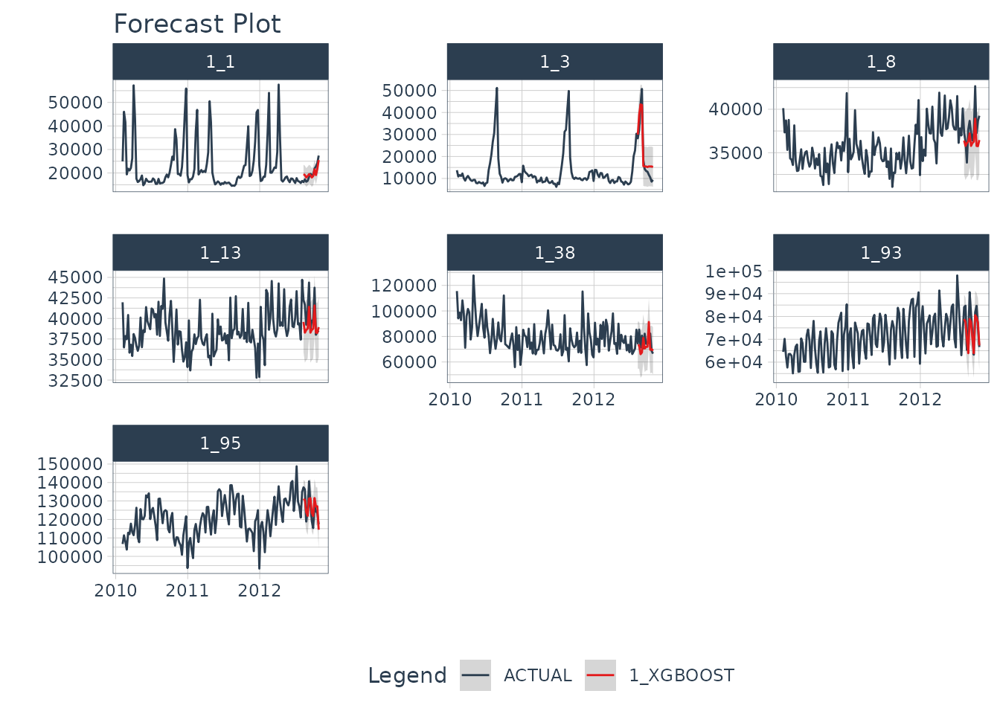
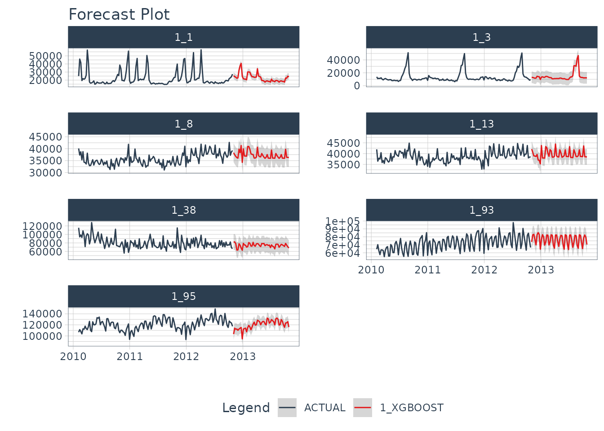

# Forecasting with Global Models


  


**Why is global modeling important for time series?** For starters, the
ability to forecast many time series with a single model that is trained
on many time series groups was a winning strategy in recent Kaggle M5
Forecasting Competition. In fact, it’s the solution we recommend in our
[Time Series
Course](https://university.business-science.io/p/ds4b-203-r-high-performance-time-series-forecasting/)
when forecasting many time series as part of a high-performance
forecasting system. Why? Because it speeds up forecasting, allowing the
data scientist to more rapidly experiment and find good solutions.

## Global Forecasting

In general, there are two methods for forecasting at scale (a slow and
accurate method and a fast and good method):

1.  **Iterative Forecasting (Slow and Accurate):** Best for accuracy but
    takes *much longer* than global model (due to for-loop iteration),
    results in many models (more memory required), and is often needed
    to be run in parallel to scale to thousands of time series
    (otherwise it can take days to complete). But, iterative forecasting
    can yield great results. See [Nested
    Forecasting](https://business-science.github.io/modeltime/articles/nested-forecasting.html)
    for our Iterative Forecasting implementation.

2.  **Global Modeling (Fast and Good):** Best for scalability to
    thousands of time series. Uses a Panel Data structure. Can scale to
    10,000+ time series easily because only a single model is made that
    generates predictions (forecasts) for all of the time series.
    Requires feature engineering and parameter tuning to get best
    performance, which can be challenging for beginners.

## Important Concepts

Students can struggle with global modeling. To help, I have a few terms
to cover that will help you understand how global modeling works (and
how it differs from iterative modeling).

### Panel Data

**The panel data structure** is the format used for global modeling. In
it’s simplest form, *Panel Data* is a time series dataset that has more
than one series. Each time series is stacked row-wise (on-top) of each
other.


Panel Data Structure

### Traditional Modeling (Iteration)

**Traditional modeling techniques like ARIMA** can only be used on one
time series at a time. The widely accepted forecasting approach is to
iterate through each time series producing a unique model and forecast
for each time series identifier. The downside with this approach is that
it’s expensive when you have many time series. Think of the number of
products in a database. As the number of time series approaches the
range of 1000-10,000, **the iterative approach becomes unscalable.**


Problem: 1000 ARIMA Models Needed for 1000 Time Series

### Global Modeling

**Global Models** are alternatives to the iterative approach. A Global
Model is a single model that forecasts all time series at once. Global
Models are highly scalable, which solves the problem of 1-10,000 time
series. An example is an XGBoost Model, which can determine
relationships for all 1000 time series panels with a single model.


Solution: A Single XGBOOST Model can Model 1000 Time Series

### Importance of Feature Engineering

The downside is that an global approach can be less accurate. To improve
accuracy, **feature engineering and localized model selection** by time
series identifier become critical to large-scale forecasting success. We
recommend learning feature engineering techniques that are proven to get
results in our [Time Series Forecasting
Course](https://university.business-science.io/p/ds4b-203-r-high-performance-time-series-forecasting/).


Modeling Panel Data

## Getting Started

We’ll cover a short tutorial on global forecasting. The first thing to
do is to load the following libraries:

``` r
library(tidymodels)
library(modeltime)
library(timetk)
```

``` r
library(tidyverse)
```

### Dataset

Next, let’s use the `walmart_sales_weekly` dataset that comes with
`timetk`.

``` r
data_tbl <- walmart_sales_weekly %>%
    select(id, date = Date, value = Weekly_Sales)

data_tbl
#> # A tibble: 1,001 × 3
#>    id    date        value
#>    <fct> <date>      <dbl>
#>  1 1_1   2010-02-05 24924.
#>  2 1_1   2010-02-12 46039.
#>  3 1_1   2010-02-19 41596.
#>  4 1_1   2010-02-26 19404.
#>  5 1_1   2010-03-05 21828.
#>  6 1_1   2010-03-12 21043.
#>  7 1_1   2010-03-19 22137.
#>  8 1_1   2010-03-26 26229.
#>  9 1_1   2010-04-02 57258.
#> 10 1_1   2010-04-09 42961.
#> # ℹ 991 more rows
```

The dataset is that is already set up for panel data modeling. The
important columns are:

- “id”: This separates the time series groups (in this case these
  represent sales from departments in a walmart store)

- “date”: This is the weekly sales period

- “value”: This is the value for sales during the week and
  store/department

We can visualize this by time series group to expose the differences in
sales by department.

``` r
data_tbl %>%
  group_by(id) %>%
  plot_time_series(
    date, value, .interactive = F, .facet_ncol = 2
  )
```


We can clearly see that there are 7 time series groups with different
weekly sales patterns.

### Train/Test Splitting

We can split the data into training and testing sets using
[`time_series_split()`](https://business-science.github.io/timetk/reference/time_series_split.html).
We’ll investigate the last 3-months of the year to test a global model
on a 3-month forecast. The message on overlapping dates is to let us
know that multiple time series are being processed using the last
3-month window for testing.

``` r
splits <- data_tbl %>% 
  time_series_split(
    assess     = "3 months", 
    cumulative = TRUE
  )
#> Using date_var: date
#> Data is not ordered by the 'date_var'. Resamples will be arranged by `date`.
#> Overlapping Timestamps Detected. Processing overlapping time series together using sliding windows.

splits
#> <Analysis/Assess/Total>
#> <917/84/1001>
```

### Recipe

**Next, we need to preprocess the data.** This is where we add good
features to imporve our global model performance. We will use the
`recipes` workflow for generating time series features.

- [`step_mutate_at()`](https://recipes.tidymodels.org/reference/step_mutate_at.html):
  Applies a function to one or more columns. Used to remove extra unused
  levels in our categorical ID column.

- [`step_timeseries_signature()`](https://business-science.github.io/timetk/reference/step_timeseries_signature.html):
  Used to add calendar features based on our date column

- [`step_rm()`](https://recipes.tidymodels.org/reference/step_rm.html):
  Used to remove the date column. Machine Learning algorithms like
  XGBoost don’t handle date columns very well.

- [`step_zv()`](https://recipes.tidymodels.org/reference/step_zv.html):
  Used to remove any zero variance features. Features with no variance
  don’t add useful information to our model.

- [`step_dummy()`](https://recipes.tidymodels.org/reference/step_dummy.html):
  Used to convert categorical features to binary one-hot encoded
  features that algorithms like XGBoost can model more effectively.

This results in 37 derived features for modeling. We can certainly
include more features such as lags and rolling features that are known
to improve results. These concepts and more are covered in the
[High-Performance Time Series
Course](https://university.business-science.io/p/ds4b-203-r-high-performance-time-series-forecasting/).

``` r
rec_obj <- recipe(value ~ ., training(splits)) %>%
    step_mutate_at(id, fn = droplevels) %>%
    step_timeseries_signature(date) %>%
    step_rm(date) %>%
    step_zv(all_predictors()) %>%
    step_dummy(all_nominal_predictors(), one_hot = TRUE)

summary(prep(rec_obj))
#> # A tibble: 38 × 4
#>    variable       type      role      source  
#>    <chr>          <list>    <chr>     <chr>   
#>  1 value          <chr [2]> outcome   original
#>  2 date_index.num <chr [2]> predictor derived 
#>  3 date_year      <chr [2]> predictor derived 
#>  4 date_year.iso  <chr [2]> predictor derived 
#>  5 date_half      <chr [2]> predictor derived 
#>  6 date_quarter   <chr [2]> predictor derived 
#>  7 date_month     <chr [2]> predictor derived 
#>  8 date_month.xts <chr [2]> predictor derived 
#>  9 date_day       <chr [2]> predictor derived 
#> 10 date_mday      <chr [2]> predictor derived 
#> # ℹ 28 more rows
```

### Machine Learning

We’ll create an `xgboost` workflow by fitting the default xgboost model
to our derived features from our in-sample training data set.

- Training the global xgboost model takes approximately 50 milliseconds.

- Conversely, an ARIMA model might take several minutes to iterate
  through possible parameter combinations for each of the 7 time series.

``` r
# Workflow
wflw_xgb <- workflow() %>%
    add_model(
        boost_tree("regression") %>% set_engine("xgboost")
    ) %>%
    add_recipe(rec_obj) %>%
    fit(training(splits))

wflw_xgb
#> ══ Workflow [trained] ══════════════════════════════════════════════════════════
#> Preprocessor: Recipe
#> Model: boost_tree()
#> 
#> ── Preprocessor ────────────────────────────────────────────────────────────────
#> 5 Recipe Steps
#> 
#> • step_mutate_at()
#> • step_timeseries_signature()
#> • step_rm()
#> • step_zv()
#> • step_dummy()
#> 
#> ── Model ───────────────────────────────────────────────────────────────────────
#> ##### xgb.Booster
#> call:
#>   xgboost::xgb.train(params = list(eta = 0.3, max_depth = 6, gamma = 0, 
#>     colsample_bytree = 1, colsample_bynode = 1, min_child_weight = 1, 
#>     subsample = 1, nthread = 1, objective = "reg:squarederror"), 
#>     data = x$data, nrounds = 15, evals = x$watchlist, verbose = 0)
#> # of features: 37 
#> # of rounds:  15 
#> callbacks:
#>    evaluation_log 
#> evaluation_log:
#>   iter training_rmse
#>  <int>         <num>
#>      1     25945.548
#>      2     18766.761
#>    ---           ---
#>     14      3171.807
#>     15      3044.555
```

### Modeltime Workflow

We’ll step through the modeltime workflow, which is used to test many
different models on the time series and organize the entire process.


Modeltime Workflow

#### Step 1: Create a Modeltime Table

The first step is to create a Modeltime Table with
[`modeltime_table()`](https://business-science.github.io/modeltime/reference/modeltime_table.md).

``` r
model_tbl <- modeltime_table(
    wflw_xgb
)

model_tbl
#> # Modeltime Table
#> # A tibble: 1 × 3
#>   .model_id .model     .model_desc
#>       <int> <list>     <chr>      
#> 1         1 <workflow> XGBOOST
```

#### Step 2: Calibrate by ID

Next, we need to calibrate, which calculates the forecast error on our
test set. Use
[`modeltime_calibrate()`](https://business-science.github.io/modeltime/reference/modeltime_calibrate.md)
to perform calibration. Note that when we add the `id`, we are able to
track the the out-of-sample residual error by the “id” column.

``` r
calib_tbl <- model_tbl %>%
    modeltime_calibrate(
      new_data = testing(splits), 
      id       = "id"
    )

calib_tbl
#> # Modeltime Table
#> # A tibble: 1 × 5
#>   .model_id .model     .model_desc .type .calibration_data
#>       <int> <list>     <chr>       <chr> <list>           
#> 1         1 <workflow> XGBOOST     Test  <tibble [84 × 5]>
```

#### Step 3: Measure Test Accuracy

Next, we measure the global and local accuracy on the global model.

##### Global Accuracy

The default is `modeltime_accuracy(acc_by_id = FALSE)`, which returns a
global model accuracy.

``` r
calib_tbl %>% 
    modeltime_accuracy(acc_by_id = FALSE) %>% 
    table_modeltime_accuracy(.interactive = FALSE)
```

| Accuracy Table |             |       |         |      |      |       |         |      |
|----------------|-------------|-------|---------|------|------|-------|---------|------|
| .model_id      | .model_desc | .type | mae     | mape | mase | smape | rmse    | rsq  |
| 1              | XGBOOST     | Test  | 3878.54 | 10.7 | 0.12 | 9.43  | 5589.75 | 0.98 |

##### Local Accuracy

By toggling `modeltime_accuracy(acc_by_id = TRUE)`, we can obtain the
local model accuracy. This can be useful for identifying specifically
which time series the model does well on (and which it does poorly on).
We can then **apply model selection logic** to select specific global
models for specific IDs.

``` r
calib_tbl %>% 
    modeltime_accuracy(acc_by_id = TRUE) %>% 
    table_modeltime_accuracy(.interactive = FALSE)
```

| Accuracy Table |             |       |      |         |       |      |       |          |      |
|----------------|-------------|-------|------|---------|-------|------|-------|----------|------|
| .model_id      | .model_desc | .type | id   | mae     | mape  | mase | smape | rmse     | rsq  |
| 1              | XGBOOST     | Test  | 1_1  | 1255.78 | 6.47  | 0.94 | 6.45  | 1487.28  | 0.85 |
| 1              | XGBOOST     | Test  | 1_3  | 5517.90 | 40.95 | 0.93 | 31.56 | 5977.40  | 0.97 |
| 1              | XGBOOST     | Test  | 1_8  | 1626.32 | 4.24  | 0.74 | 4.33  | 1967.48  | 0.51 |
| 1              | XGBOOST     | Test  | 1_13 | 1203.46 | 2.91  | 0.53 | 2.96  | 1447.33  | 0.74 |
| 1              | XGBOOST     | Test  | 1_38 | 9818.34 | 12.66 | 1.21 | 13.05 | 11486.56 | 0.06 |
| 1              | XGBOOST     | Test  | 1_93 | 3143.20 | 4.04  | 0.31 | 4.09  | 4335.14  | 0.76 |
| 1              | XGBOOST     | Test  | 1_95 | 4584.76 | 3.62  | 0.58 | 3.60  | 4906.70  | 0.70 |

#### Step 4: Forecast the Test Data

Next, we need to forecast the test dataset. This is useful to evaluate
the model using a sampling of the time series within the panel dataset.
We use `modeltime_forecast(conf_by_id = TRUE)` to allow the confidence
intervals (prediction intervals) to be calculated by time series
identifier. Note, that the
[`modeltime_calibrate()`](https://business-science.github.io/modeltime/reference/modeltime_calibrate.md)
must have been performed with an `id` specified.

``` r
calib_tbl %>%
    modeltime_forecast(
        new_data    = testing(splits),
        actual_data = data_tbl,
        conf_by_id  = TRUE
    ) %>%
    group_by(id) %>%
    plot_modeltime_forecast(
        .facet_ncol  = 3,
        .interactive = FALSE
    )
```



#### Step 5: Refit and Forecast the Future

We see that our global model performs well on this dataset. Now, we will
forecast the future.

##### Refit the Models

The refitting step is needed to incorporate the most recent information
into our models. We use
[`modeltime_refit()`](https://business-science.github.io/modeltime/reference/modeltime_refit.md)
to update the model(s) in our modeltime tables.

``` r
refit_tbl <- calib_tbl %>%
  modeltime_refit(data = data_tbl)

refit_tbl
#> # Modeltime Table
#> # A tibble: 1 × 5
#>   .model_id .model     .model_desc .type .calibration_data
#>       <int> <list>     <chr>       <chr> <list>           
#> 1         1 <workflow> XGBOOST     Test  <tibble [84 × 5]>
```

##### Future Data

Next, make a future dataset using
[`future_frame()`](https://business-science.github.io/timetk/reference/future_frame.html)
from `timetk`, which creates future time stamps that extend 52-weeks
into the future for each ID in the same panel structure needed for our
global forecast model.

``` r
future_tbl <- data_tbl %>%
  group_by(id) %>%
  future_frame(.length_out = 52, .bind_data = FALSE)

future_tbl
#> # A tibble: 364 × 2
#> # Groups:   id [7]
#>    id    date      
#>    <fct> <date>    
#>  1 1_1   2012-11-02
#>  2 1_1   2012-11-09
#>  3 1_1   2012-11-16
#>  4 1_1   2012-11-23
#>  5 1_1   2012-11-30
#>  6 1_1   2012-12-07
#>  7 1_1   2012-12-14
#>  8 1_1   2012-12-21
#>  9 1_1   2012-12-28
#> 10 1_1   2013-01-04
#> # ℹ 354 more rows
```

##### Future Predictions

Finally, we can forecast the future using our future data.

``` r
refit_tbl %>%
  modeltime_forecast(
    new_data    = future_tbl,
    actual_data = data_tbl, 
    conf_by_id  = TRUE
  ) %>%
  group_by(id) %>%
  plot_modeltime_forecast(
    .interactive = F,
    .facet_ncol  = 2
  )
```



## Summary

We’ve now successfully completed a **Global Forecast.** You may find
this challenging, especially if you are not familiar with the Modeltime
Workflow, terminology, or tidymodeling in R. If this is the case, we
have a solution. Take our high-performance forecasting course.

### Take the High-Performance Forecasting Course

> Become the forecasting expert for your organization

[](https://university.business-science.io/p/ds4b-203-r-high-performance-time-series-forecasting/)

[*High-Performance Time Series
Course*](https://university.business-science.io/p/ds4b-203-r-high-performance-time-series-forecasting/)

#### Time Series is Changing

Time series is changing. **Businesses now need 10,000+ time series
forecasts every day.** This is what I call a *High-Performance Time
Series Forecasting System (HPTSF)* - Accurate, Robust, and Scalable
Forecasting.

**High-Performance Forecasting Systems will save companies by improving
accuracy and scalability.** Imagine what will happen to your career if
you can provide your organization a “High-Performance Time Series
Forecasting System” (HPTSF System).

#### How to Learn High-Performance Time Series Forecasting

I teach how to build a HPTFS System in my [**High-Performance Time
Series Forecasting
Course**](https://university.business-science.io/p/ds4b-203-r-high-performance-time-series-forecasting).
You will learn:

- **Time Series Machine Learning** (cutting-edge) with `Modeltime` - 30+
  Models (Prophet, ARIMA, XGBoost, Random Forest, & many more)
- **Deep Learning** with `GluonTS` (Competition Winners)
- **Time Series Preprocessing**, Noise Reduction, & Anomaly Detection
- **Feature engineering** using lagged variables & external regressors
- **Hyperparameter Tuning**
- **Time series cross-validation**
- **Ensembling** Multiple Machine Learning & Univariate Modeling
  Techniques (Competition Winner)
- **Scalable Forecasting** - Forecast 1000+ time series in parallel
- and more.

Become the Time Series Expert for your organization.

  

[Take the High-Performance Time Series Forecasting
Course](https://university.business-science.io/p/ds4b-203-r-high-performance-time-series-forecasting)
