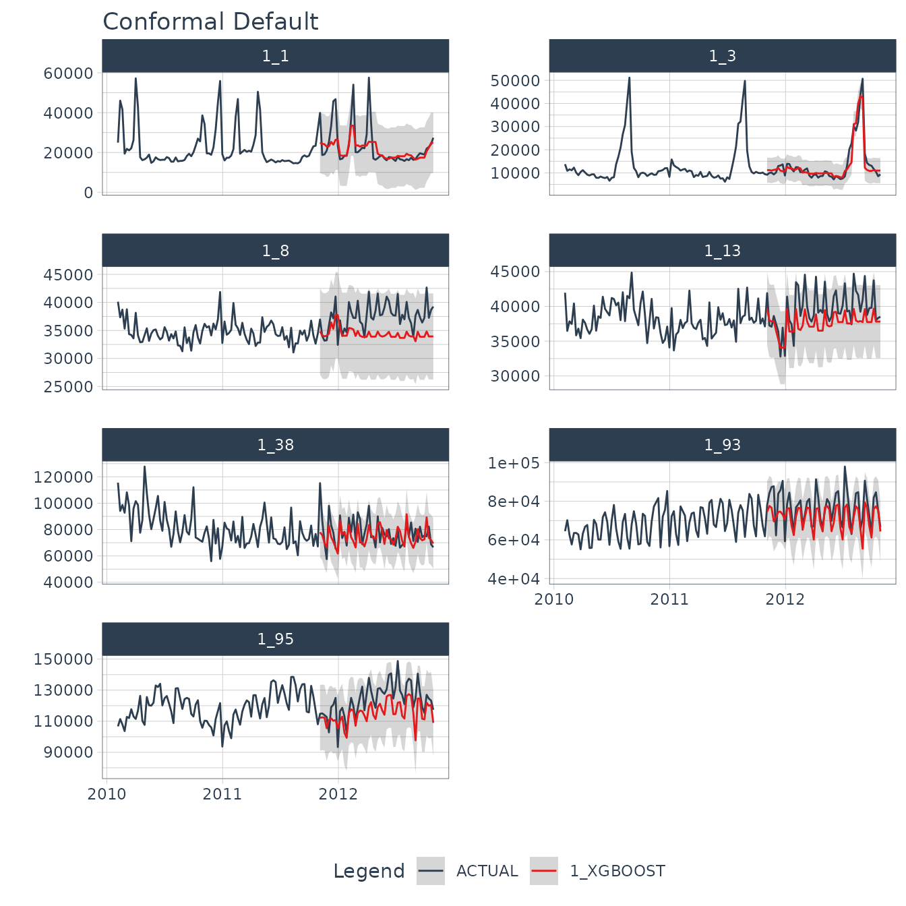
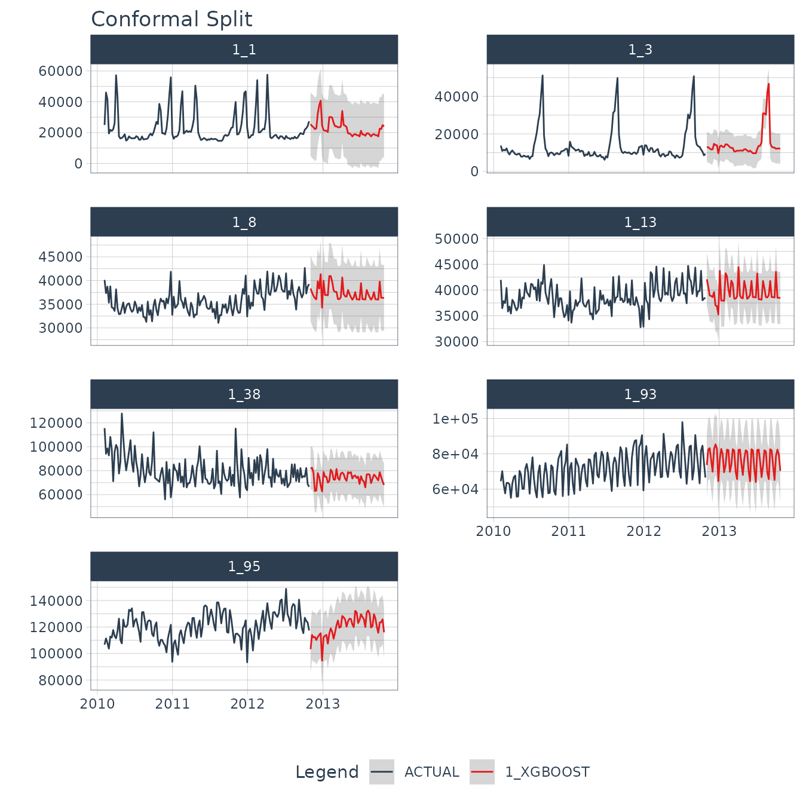

# Conformal Forecast Prediction Intervals in Modeltime


Modeltime integrates Conformal Prediction Intervals as part of its time
series forecasting workflow. This tutorial showcases 2 methods for
Conformal Prediction Intervals:

1.  **Conformal Default Method:** Uses
    [`qnorm()`](https://rdrr.io/r/stats/Normal.html) to compute
    quantiles from out-of-sample (test set) residuals.

2.  **Conformal Split Method** Uses the split method split conformal
    inference method described by Lei et al (2018)

## Time Series Conformal Forecasting Prediction Interval Tutorial

Load libraries to complete this short tutorial.

``` r
library(tidyverse)
```

``` r
library(tidymodels)
library(modeltime)
library(timetk)

# This toggles plots from plotly (interactive) to ggplot (static)
interactive <- FALSE
```

### Step 1 - Collect data and split into training, test, and future data sets.

We’ll start with the Walmart Sales data set from `timetk`.

``` r
# Data

walmart_sales_tbl <- timetk::walmart_sales_weekly %>%
    select(id, Date, Weekly_Sales) %>%
    mutate(id = forcats::as_factor(id))
```

We can visualize the data set.

``` r
walmart_sales_tbl %>%
    group_by(id) %>%
    plot_time_series(
        Date, Weekly_Sales,
        .facet_ncol  = 2,
        .interactive = interactive,
    )
```


Let’s split the data into training and test sets using
[`time_series_split()`](https://business-science.github.io/timetk/reference/time_series_split.html)

``` r
# Split Data 80/20
splits <- time_series_split(
    walmart_sales_tbl,
    assess     = "1 year",
    cumulative = TRUE
)

splits
#> <Analysis/Assess/Total>
#> <637/364/1001>
```

Finally, let’s make a future dataset that will be used to forecast the
next 1 year.

``` r
new_data_tbl <- walmart_sales_tbl %>%
    group_by(id) %>%
    future_frame(.length_out = "1 year") %>%
    ungroup()
```

### Step 2 - Create & Fit Forecasting Models

We’ll set up an XGBoost forecasting model for this tutorial.

#### Recipe

First, let’s create a recipe. This step creates a number of time series
features and one-hot encodes any categorical features.

``` r
recipe_ml <- recipe(Weekly_Sales ~ ., training(splits)) %>%
    step_timeseries_signature(Date) %>%
    step_rm(Date) %>%
    step_dummy(all_nominal_predictors(), one_hot = TRUE)

recipe_ml
```

#### Model & Workflow

Next, let’s create the model and fit the recipe and model on the
training dataset.

``` r
model_xgb <- boost_tree("regression") %>%
    set_engine("xgboost")

wflw_fit_xgb <- workflow() %>%
    add_model(model_xgb) %>%
    add_recipe(recipe_ml) %>%
    fit(training(splits))

wflw_fit_xgb
#> ══ Workflow [trained] ══════════════════════════════════════════════════════════
#> Preprocessor: Recipe
#> Model: boost_tree()
#> 
#> ── Preprocessor ────────────────────────────────────────────────────────────────
#> 3 Recipe Steps
#> 
#> • step_timeseries_signature()
#> • step_rm()
#> • step_dummy()
#> 
#> ── Model ───────────────────────────────────────────────────────────────────────
#> ##### xgb.Booster
#> call:
#>   xgboost::xgb.train(params = list(eta = 0.3, max_depth = 6, gamma = 0, 
#>     colsample_bytree = 1, colsample_bynode = 1, min_child_weight = 1, 
#>     subsample = 1, nthread = 1, objective = "reg:squarederror"), 
#>     data = x$data, nrounds = 15, evals = x$watchlist, verbose = 0)
#> # of features: 3375 
#> # of rounds:  15 
#> callbacks:
#>    evaluation_log 
#> evaluation_log:
#>   iter training_rmse
#>  <int>         <num>
#>      1     25736.090
#>      2     18642.080
#>    ---           ---
#>     14      3026.162
#>     15      2638.004
```

### Step 3 - Add fitted models to a Model Table.

The next step is to add model(s) to a modeltime table. This step stores
the model in a data frame for organizational purposes.

``` r
models_tbl <- modeltime_table(
     wflw_fit_xgb
)

models_tbl
#> # Modeltime Table
#> # A tibble: 1 × 3
#>   .model_id .model     .model_desc
#>       <int> <list>     <chr>      
#> 1         1 <workflow> XGBOOST
```

### Step 4 - Calibrate the model to a testing set.

Next, we calibrate the model using the testing set. Note- I’m using the
`id = "id"` which allows us to track confidence for each time series
group in our dataset. The column “id” is used as the grouping column.

``` r
calibration_tbl <- models_tbl %>%
    modeltime_calibrate(
        new_data = testing(splits), 
        id       = "id"
    )

calibration_tbl
#> # Modeltime Table
#> # A tibble: 1 × 5
#>   .model_id .model     .model_desc .type .calibration_data 
#>       <int> <list>     <chr>       <chr> <list>            
#> 1         1 <workflow> XGBOOST     Test  <tibble [364 × 5]>
```

## Conformal Prediction

With the calibration table in hand, we can now implement the conformal
prediction interval. Currently, there are 2 methods implemented in
`modeltime_forecast`:

1.  `conformal_default`: Uses
    [`qnorm()`](https://rdrr.io/r/stats/Normal.html) to compute
    quantiles from out-of-sample (test set) residuals.

2.  `conformal_split`: Uses the split method split conformal inference
    method described by Lei et al (2018)

### Conformal Default Method

The default method has been implemented in modeltime from the start of
the `modeltime` package.

- This method uses [`qnorm()`](https://rdrr.io/r/stats/Normal.html) to
  produce a 95% confidence interval by default. It estimates a normal
  (Gaussian distribution) based on the out-of-sample errors (residuals).

- The confidence interval is mean-adjusted, meaning that if the mean of
  the residuals is non-zero, the confidence interval is adjusted to
  widen the interval to capture the difference in means.

Here we implement a 95% confidence interval meaning 95% of the test data
will fall within the boundaries. The
[`tail()`](https://rdrr.io/r/utils/head.html) function is used to show
the .conf_lo and .conf_hi probabilistic prediction intervals.

``` r
forecast_tbl <- calibration_tbl %>%
    modeltime_forecast(
        new_data      = testing(splits),
        actual_data   = walmart_sales_tbl,
        conf_interval = 0.95,
        conf_method   = "conformal_default", # Default Conformal Method
        conf_by_id    = TRUE, # TRUE = local CI by ID, FALSE = global CI
        keep_data     = TRUE
    )

# Last 7 data points for (1 for each time series)
forecast_tbl %>% tail(7)
#> # Forecast Results
#> 
#> # A tibble: 7 × 10
#>   .model_id .model_desc .key       .index      .value .conf_lo .conf_hi id   
#>       <int> <chr>       <fct>      <date>       <dbl>    <dbl>    <dbl> <fct>
#> 1         1 XGBOOST     prediction 2012-10-26  25747.   10798.   40696. 1_1  
#> 2         1 XGBOOST     prediction 2012-10-26  10273.    5409.   15137. 1_3  
#> 3         1 XGBOOST     prediction 2012-10-26  34225.   27038.   41412. 1_8  
#> 4         1 XGBOOST     prediction 2012-10-26  37819.   32126.   43512. 1_13 
#> 5         1 XGBOOST     prediction 2012-10-26  69153.   48586.   89720. 1_38 
#> 6         1 XGBOOST     prediction 2012-10-26  65262.   49876.   80648. 1_93 
#> 7         1 XGBOOST     prediction 2012-10-26 108383.   88660.  128107. 1_95 
#> # ℹ 2 more variables: Date <date>, Weekly_Sales <dbl>
```

We can visualize the probability intervals for the Conformal Default
method.

``` r
forecast_tbl %>%
    group_by(id) %>%
    plot_modeltime_forecast(
        .facet_ncol  = 2, 
        .interactive = interactive,
        .title       = "Conformal Default"
    )
```



### Conformal Split Method

When `conf_method = "conformal_split`, this method uses the split
conformal inference method described by Lei et al (2018). This is also
implemented in the `probably` R package’s `int_conformal_split()`
function.

``` r
forecast_tbl <- calibration_tbl %>%
    modeltime_forecast(
        new_data      = testing(splits),
        actual_data   = walmart_sales_tbl,
        conf_interval = 0.95,
        conf_method   = "conformal_split", # Split Conformal Method
        conf_by_id    = TRUE, # TRUE = local CI by ID, FALSE = global CI
        keep_data     = TRUE
    )

# Last 7 data points for (1 for each time series)
forecast_tbl %>% tail(7)
#> # Forecast Results
#> 
#> # A tibble: 7 × 10
#>   .model_id .model_desc .key       .index      .value .conf_lo .conf_hi id   
#>       <int> <chr>       <fct>      <date>       <dbl>    <dbl>    <dbl> <fct>
#> 1         1 XGBOOST     prediction 2012-10-26  25747.    4665.   46829. 1_1  
#> 2         1 XGBOOST     prediction 2012-10-26  10273.    4925.   15621. 1_3  
#> 3         1 XGBOOST     prediction 2012-10-26  34225.   27898.   40551. 1_8  
#> 4         1 XGBOOST     prediction 2012-10-26  37819.   32716.   42922. 1_13 
#> 5         1 XGBOOST     prediction 2012-10-26  69153.   50310.   87996. 1_38 
#> 6         1 XGBOOST     prediction 2012-10-26  65262.   45404.   85119. 1_93 
#> 7         1 XGBOOST     prediction 2012-10-26 108383.   86524.  130243. 1_95 
#> # ℹ 2 more variables: Date <date>, Weekly_Sales <dbl>
```

We can visualize the probability intervals for the Conformal Split
method.

``` r
forecast_tbl %>%
    group_by(id) %>%
    plot_modeltime_forecast(
        .facet_ncol  = 2, 
        .interactive = interactive,
        .title       = "Conformal Split"
    )
```


## Refit and Future Forecast

Many Conformal Prediction tutorials fail to show how to make the future
forecast for data that has not happened yet. I aim to fix this. Using
the following code, we can quickly refit the model and make the future
forecast applying the conformal probabilities to the future forecast
estimates.

``` r
refit_tbl <- calibration_tbl %>%
    modeltime_refit(walmart_sales_tbl)

forecast_future_tbl <- refit_tbl %>%
    modeltime_forecast(
        new_data      = new_data_tbl,
        actual_data   = walmart_sales_tbl,
        conf_interval = 0.95,
        conf_method   = "conformal_split", # Split Conformal Method
        conf_by_id    = TRUE, # TRUE = local CI by ID, FALSE = global CI
        keep_data     = TRUE
    )
```

With the future forecast, we can visualize both the point estimates and
the 95% conformal probability region.

``` r
forecast_future_tbl %>%
    group_by(id) %>%
    plot_modeltime_forecast(
        .facet_ncol  = 2, 
        .interactive = interactive,
        .title       = "Conformal Split"
    )
```



## Summary

You have just seen how to do a simple Conformal Prediction estimate for
a global time series model. But this is a simple problem. And, there’s a
lot more to learning time series.

- Many more algorithms
- Ensembling
- Machine Learning
- Deep Learning
- Iterative Forecasting
- Scalable Modeling: 10,000+ time series

Your probably thinking how am I ever going to learn time series
forecasting. Here’s the solution that will save you years of struggling.

## Take the High-Performance Forecasting Course

> Become the forecasting expert for your organization

[](https://university.business-science.io/p/ds4b-203-r-high-performance-time-series-forecasting/)

[*High-Performance Time Series
Course*](https://university.business-science.io/p/ds4b-203-r-high-performance-time-series-forecasting/)

### Time Series is Changing

Time series is changing. **Businesses now need 10,000+ time series
forecasts every day.** This is what I call a *High-Performance Time
Series Forecasting System (HPTSF)* - Accurate, Robust, and Scalable
Forecasting.

**High-Performance Forecasting Systems will save companies by improving
accuracy and scalability.** Imagine what will happen to your career if
you can provide your organization a “High-Performance Time Series
Forecasting System” (HPTSF System).

### How to Learn High-Performance Time Series Forecasting

I teach how to build a HPTFS System in my [**High-Performance Time
Series Forecasting
Course**](https://university.business-science.io/p/ds4b-203-r-high-performance-time-series-forecasting).
You will learn:

- **Time Series Machine Learning** (cutting-edge) with `Modeltime` - 30+
  Models (Prophet, ARIMA, XGBoost, Random Forest, & many more)
- **Deep Learning** with `GluonTS` (Competition Winners)
- **Time Series Preprocessing**, Noise Reduction, & Anomaly Detection
- **Feature engineering** using lagged variables & external regressors
- **Hyperparameter Tuning**
- **Time series cross-validation**
- **Ensembling** Multiple Machine Learning & Univariate Modeling
  Techniques (Competition Winner)
- **Scalable Forecasting** - Forecast 1000+ time series in parallel
- and more.

Become the Time Series Expert for your organization.

  

[Take the High-Performance Time Series Forecasting
Course](https://university.business-science.io/p/ds4b-203-r-high-performance-time-series-forecasting)
