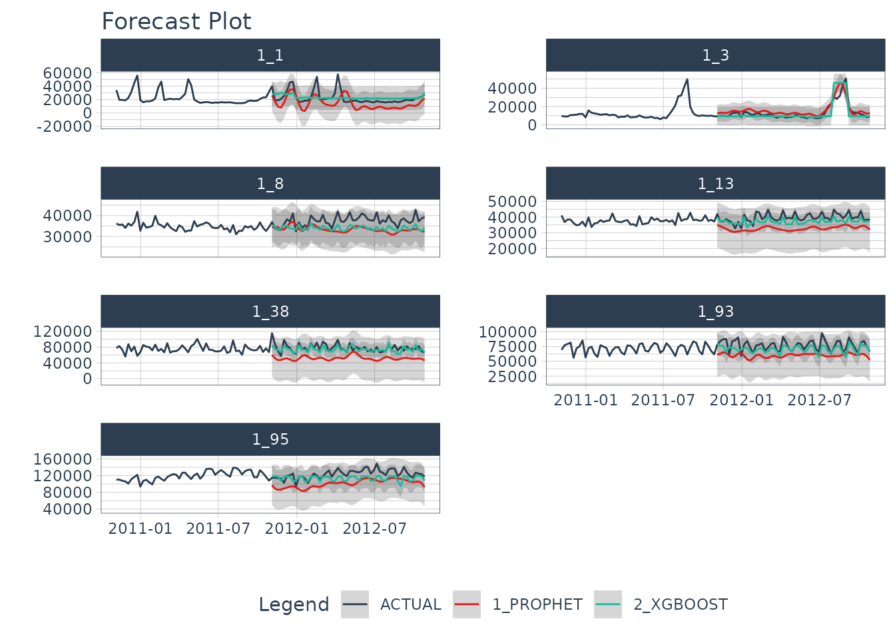
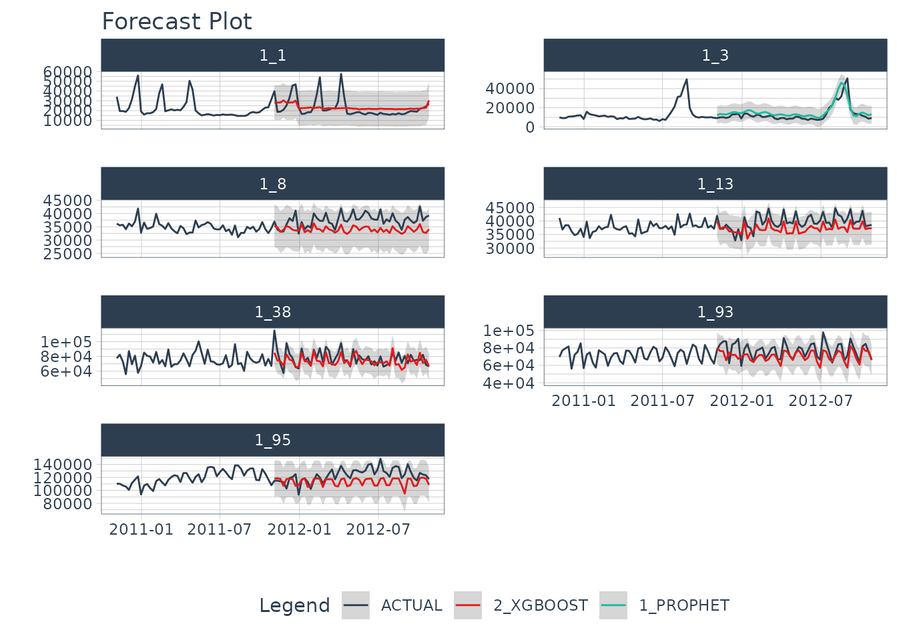
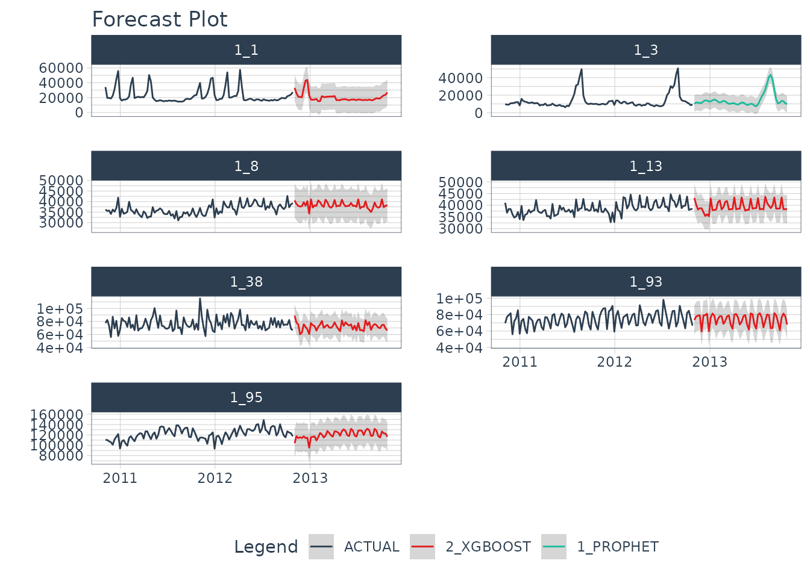

# Nested Forecasting

> Iteratively forecast with nested modeling

**Why is nested forecasting important?** For starters, the ability to
*iteratively forecast* time series with many models that are trained on
many individual groups has been a huge request from students in our
[Time Series
Course](https://university.business-science.io/p/ds4b-203-r-high-performance-time-series-forecasting/).
Why? Because two methods exist that get results:

1.  **Global Modeling:** Best for scalability using a Global Models and
    a Panel Data structure. See [Forecasting with Global
    Models](https://business-science.github.io/modeltime/articles/modeling-panel-data.html).

2.  **Iterative Forecasting:** Best for accuracy using a Nested Data
    Structure. Takes longer than global model (more resources due to
    for-loop iteration), but can yield great results.

We’ve incorporated a new approach called ***“nested forecasting”*** to
help perform *Iterative Forecasting*.

## Nested Forecasting

The core idea of **nested forecasting** is to convert a dataset
containing **many time series groups** into a nested data set, then fit
**many models** to each of the nested datasets. The result is an
iterative forecasting process that generates Nested Modeltime Tables
with all of the forecast attributes needed to make decisions.


## Important Concepts: Logging & Attributes

A new feature to nested forecasting workflow is **logged attributes**,
which is very useful in complex workflows where loops (iteration) is
performed. In a *Nested Modeltime Table*, we push as many operations as
possible into the fitting and refitting stages, logging important
aspects including:

- **Test Accuracy:**
  [`extract_nested_test_accuracy()`](https://business-science.github.io/modeltime/reference/log_extractors.md)
- **Test Forecast:**
  [`extract_nested_test_forecast()`](https://business-science.github.io/modeltime/reference/log_extractors.md)
- **Error Reports:**
  [`extract_nested_error_report()`](https://business-science.github.io/modeltime/reference/log_extractors.md)
- **Best Models:**
  [`extract_nested_best_model_report()`](https://business-science.github.io/modeltime/reference/log_extractors.md)
- **Future Forecasts:**
  [`extract_nested_future_forecast()`](https://business-science.github.io/modeltime/reference/log_extractors.md)

While this deviates from the traditional Modeltime Workflow, we find
that **logging vastly speeds up experimentation and information
retrieval** especially when the number of time series increases.


## Getting Started

We’ll go through a short tutorial on **Nested Forecasting.** The first
thing to do is to load the following libraries:

``` r
library(modeltime)
library(tidymodels)
library(tidyverse)
library(timetk)
```

### Dataset

Next, let’s use the `walmart_sales_weekly` dataset that comes with
`timetk`.

``` r
data_tbl <- walmart_sales_weekly %>%
    select(id, date = Date, value = Weekly_Sales)

data_tbl
#> # A tibble: 1,001 × 3
#>    id    date        value
#>    <fct> <date>      <dbl>
#>  1 1_1   2010-02-05 24924.
#>  2 1_1   2010-02-12 46039.
#>  3 1_1   2010-02-19 41596.
#>  4 1_1   2010-02-26 19404.
#>  5 1_1   2010-03-05 21828.
#>  6 1_1   2010-03-12 21043.
#>  7 1_1   2010-03-19 22137.
#>  8 1_1   2010-03-26 26229.
#>  9 1_1   2010-04-02 57258.
#> 10 1_1   2010-04-09 42961.
#> # ℹ 991 more rows
```

The problem with this dataset is that it’s set up for panel data
modeling. The important columns are:

- “id”: This separates the time series groups (in this case these
  represent sales from departments in a walmart store)

- “date”: This is the weekly sales period

- “value”: This is the value for sales during the week and
  store/department

We can visualize this by time series group to expose the differences in
sales by department.

``` r
data_tbl %>%
  group_by(id) %>%
  plot_time_series(
    date, value, .interactive = FALSE, .facet_ncol = 2
  )
```


We can clearly see that there are 7 time series groups with different
weekly sales patterns.

### Nested Forecasting Preparation

There are two key components that we need to prepare for:

1.  **Nested Data Structure:** Most critical to ensure your data is
    prepared (covered next)

2.  **Nested Modeltime Workflow:** This stage is where we create many
    models, fit the models to the data, and generate forecasts at scale

Conceptually, the workflow looks like this where we combine nested data
and tidymodels workflows using an upcoming function,
[`modeltime_nested_fit()`](https://business-science.github.io/modeltime/reference/modeltime_nested_fit.md).


## Data Preparation

The most critical stage in **“Nested Forecasting”** is data preparation,
making sure that the input to the nested forecasting workflow is in the
appropriate structure. We’ve included several functions to help that
involve a bit of forethought that can be broken into 3 steps:

1.  **Extending each of the times series:** How far into the future do
    you need to predict for each time series? See
    [`extend_timeseries()`](https://business-science.github.io/modeltime/reference/prep_nested.md).

2.  **Nesting by the grouping variable:** This is where you create the
    nested structure. You’ll identify the ID column that separates each
    time series, and the number of timestamps to include in the
    “.future_data” and optionally “.actual_data”. Typically, you’ll
    select the same `.length_future` as your extension from the previous
    step. See
    [`nest_timeseries()`](https://business-science.github.io/modeltime/reference/prep_nested.md).

3.  **Train/Test Set Splitting:** Finally, you’ll take your
    `.actual_data` and convert into train/test splits that can be used
    for accuracy and confidence interval estimation. See
    [`split_nested_timeseries()`](https://business-science.github.io/modeltime/reference/prep_nested.md).

Here are the 3-steps in action:

``` r
nested_data_tbl <- data_tbl %>%
    
    # 1. Extending: We'll predict 52 weeks into the future.
    extend_timeseries(
        .id_var        = id,
        .date_var      = date,
        .length_future = 52
    ) %>%
    
    # 2. Nesting: We'll group by id, and create a future dataset
    #    that forecasts 52 weeks of extended data and
    #    an actual dataset that contains 104 weeks (2-years of data)
    nest_timeseries(
        .id_var        = id,
        .length_future = 52,
        .length_actual = 52*2
    ) %>%
    
   # 3. Splitting: We'll take the actual data and create splits
   #    for accuracy and confidence interval estimation of 52 weeks (test)
   #    and the rest is training data
    split_nested_timeseries(
        .length_test = 52
    )

nested_data_tbl
#> # A tibble: 7 × 4
#>   id    .actual_data       .future_data      .splits        
#>   <fct> <list>             <list>            <list>         
#> 1 1_1   <tibble [104 × 2]> <tibble [52 × 2]> <split [52|52]>
#> 2 1_3   <tibble [104 × 2]> <tibble [52 × 2]> <split [52|52]>
#> 3 1_8   <tibble [104 × 2]> <tibble [52 × 2]> <split [52|52]>
#> 4 1_13  <tibble [104 × 2]> <tibble [52 × 2]> <split [52|52]>
#> 5 1_38  <tibble [104 × 2]> <tibble [52 × 2]> <split [52|52]>
#> 6 1_93  <tibble [104 × 2]> <tibble [52 × 2]> <split [52|52]>
#> 7 1_95  <tibble [104 × 2]> <tibble [52 × 2]> <split [52|52]>
```

This creates a nested tibble with “.actual_data”, “.future_data”, and
“.splits”. Each column will help in the nested modeltime workflow.

## Nested Modeltime Workflow

Next, we move into the **Nested Modeltime Workflow** now that nested
data has been created. The Nested Modeltime Workflow includes 3 core
functions:

1.  **Modeling Fitting:** This is the training stage where we fit to
    *training data*. The *test forecast* is generated from this step.
    See
    [`modeltime_nested_fit()`](https://business-science.github.io/modeltime/reference/modeltime_nested_fit.md).

2.  **Model Evaluation and Selection:** This is where we review model
    performance and select the best model by minimizing or maximizing an
    error metric. See
    [`modeltime_nested_select_best()`](https://business-science.github.io/modeltime/reference/modeltime_nested_select_best.md).

3.  **Model Refitting:** This is the final fitting stage where we fit to
    *actual data*. The *future forecast* is generated from this step.
    See
    [`modeltime_nested_refit()`](https://business-science.github.io/modeltime/reference/modeltime_nested_refit.md).


### Step 1: Create Tidymodels Workflows

First, we create `tidymodels` workflows for the various models that you
intend to create.

#### Prophet

A common modeling method is prophet, that can be created using
[`prophet_reg()`](https://business-science.github.io/modeltime/reference/prophet_reg.md).
We’ll create a workflow. Note that we use the
`extract_nested_train_split(nested_data_tbl)` to help us build
preprocessing features.

``` r
rec_prophet <- recipe(value ~ date, extract_nested_train_split(nested_data_tbl)) 

wflw_prophet <- workflow() %>%
    add_model(
      prophet_reg("regression", seasonality_yearly = TRUE) %>% 
        set_engine("prophet")
    ) %>%
    add_recipe(rec_prophet)
```

#### XGBoost

Next, we can use a machine learning method that can get good results:
XGBoost. We will add a few extra features in the recipe feature
engineering step to generate features that tend to get better modeling
results. Note that we use the
`extract_nested_train_split(nested_data_tbl)` to help us build
preprocessing features.

``` r
rec_xgb <- recipe(value ~ ., extract_nested_train_split(nested_data_tbl)) %>%
    step_timeseries_signature(date) %>%
    step_rm(date) %>%
    step_zv(all_predictors()) %>%
    step_dummy(all_nominal_predictors(), one_hot = TRUE)

wflw_xgb <- workflow() %>%
    add_model(boost_tree("regression") %>% set_engine("xgboost")) %>%
    add_recipe(rec_xgb)
```

### Step 2: Nested Modeltime Tables

With a couple of modeling workflows in hand, we are now ready to test
them on each of the time series. We start by using the
[`modeltime_nested_fit()`](https://business-science.github.io/modeltime/reference/modeltime_nested_fit.md)
function, which iteratively fits each model to each of the nested time
series train/test “.splits” column.

``` r
nested_modeltime_tbl <- modeltime_nested_fit(
  # Nested data 
  nested_data = nested_data_tbl,
  
  # Add workflows
  wflw_prophet,
  wflw_xgb
)
#> Fitting models on training data... ■■■■■                             14% | ETA:…
#> Fitting models on training data... ■■■■■■■■■■■■■■                    43% | ETA:…
#> Fitting models on training data... ■■■■■■■■■■■■■■■■■■■■■■■■■■■       86% | ETA:…
#> Fitting models on training data... ■■■■■■■■■■■■■■■■■■■■■■■■■■■■■■■  100% | ETA:…

nested_modeltime_tbl
#> # Nested Modeltime Table
#> 
#> Trained on: .splits | Forecast Errors: [0] | Conf Method: conformal_default |
#> Conf Interval: 0.95
#> # A tibble: 7 × 5
#>   id    .actual_data       .future_data      .splits         .modeltime_tables 
#>   <fct> <list>             <list>            <list>          <list>            
#> 1 1_1   <tibble [104 × 2]> <tibble [52 × 2]> <split [52|52]> <mdl_tm_t [2 × 5]>
#> 2 1_3   <tibble [104 × 2]> <tibble [52 × 2]> <split [52|52]> <mdl_tm_t [2 × 5]>
#> 3 1_8   <tibble [104 × 2]> <tibble [52 × 2]> <split [52|52]> <mdl_tm_t [2 × 5]>
#> 4 1_13  <tibble [104 × 2]> <tibble [52 × 2]> <split [52|52]> <mdl_tm_t [2 × 5]>
#> 5 1_38  <tibble [104 × 2]> <tibble [52 × 2]> <split [52|52]> <mdl_tm_t [2 × 5]>
#> 6 1_93  <tibble [104 × 2]> <tibble [52 × 2]> <split [52|52]> <mdl_tm_t [2 × 5]>
#> 7 1_95  <tibble [104 × 2]> <tibble [52 × 2]> <split [52|52]> <mdl_tm_t [2 × 5]>
```

This adds a new column with `.modeltime_tables` for each of the data
sets and has created several **logged attributes** that are part of the
“Nested Modeltime Table”. We also can see that the models were trained
on “.splits” and none of the models had any errors.

### Step 3: Logged Attributes

During the forecasting, the iterative modeltime fitting process logs
important information that enable us to evaluate the models. These
logged attributes are accessible with “extract” functions.

#### Extract Nested Test Accuracy

Using the
[`extract_nested_test_accuracy()`](https://business-science.github.io/modeltime/reference/log_extractors.md),
we can get the accuracy measures by time series and model. This allows
us to see which model performs best on which time series.

``` r
nested_modeltime_tbl %>% 
  extract_nested_test_accuracy() %>%
  table_modeltime_accuracy(.interactive = F)
```

| Accuracy Table |           |             |       |          |       |      |       |          |      |
|----------------|-----------|-------------|-------|----------|-------|------|-------|----------|------|
| id             | .model_id | .model_desc | .type | mae      | mape  | mase | smape | rmse     | rsq  |
| 1_1            | 1         | PROPHET     | Test  | 10071.47 | 45.88 | 1.99 | 59.97 | 11776.87 | 0.38 |
| 1_1            | 2         | XGBOOST     | Test  | 10050.28 | 48.33 | 1.98 | 39.38 | 11055.25 | 0.10 |
| 1_3            | 1         | PROPHET     | Test  | 3539.80  | 29.87 | 1.37 | 25.46 | 4707.77  | 0.80 |
| 1_3            | 2         | XGBOOST     | Test  | 3079.89  | 19.68 | 1.20 | 20.10 | 5062.07  | 0.79 |
| 1_8            | 1         | PROPHET     | Test  | 4282.96  | 11.15 | 1.82 | 11.96 | 4845.08  | 0.00 |
| 1_8            | 2         | XGBOOST     | Test  | 3015.98  | 7.82  | 1.28 | 8.23  | 3472.07  | 0.31 |
| 1_13           | 1         | PROPHET     | Test  | 6861.13  | 17.02 | 2.53 | 18.78 | 7309.61  | 0.15 |
| 1_13           | 2         | XGBOOST     | Test  | 1863.15  | 4.66  | 0.69 | 4.74  | 2338.75  | 0.51 |
| 1_38           | 1         | PROPHET     | Test  | 26007.21 | 32.57 | 2.22 | 39.60 | 27938.83 | 0.08 |
| 1_38           | 2         | XGBOOST     | Test  | 7153.89  | 8.93  | 0.61 | 9.07  | 9257.22  | 0.25 |
| 1_93           | 1         | PROPHET     | Test  | 17165.30 | 21.37 | 1.73 | 24.46 | 19123.17 | 0.03 |
| 1_93           | 2         | XGBOOST     | Test  | 5674.42  | 7.00  | 0.57 | 7.40  | 7669.85  | 0.60 |
| 1_95           | 1         | PROPHET     | Test  | 22836.06 | 18.30 | 2.75 | 20.37 | 24094.49 | 0.48 |
| 1_95           | 2         | XGBOOST     | Test  | 8316.47  | 6.80  | 1.00 | 6.81  | 10017.16 | 0.15 |

#### Extract Nested Test Forecast

Next, we can visualize the test forecast with
[`extract_nested_test_forecast()`](https://business-science.github.io/modeltime/reference/log_extractors.md).

``` r
nested_modeltime_tbl %>% 
  extract_nested_test_forecast() %>%
  group_by(id) %>%
  plot_modeltime_forecast(
    .facet_ncol  = 2,
    .interactive = FALSE
  )
```



#### Extract Nested Error Logs

If any of the models have errors, then we can investigate the error logs
with
[`extract_nested_error_report()`](https://business-science.github.io/modeltime/reference/log_extractors.md).
Fortunately, we don’t have any errors, but if we did we could
investigate further.

``` r
nested_modeltime_tbl %>% 
  extract_nested_error_report()
#> # A tibble: 0 × 4
#> # ℹ 4 variables: id <fct>, .model_id <int>, .model_desc <chr>,
#> #   .error_desc <chr>
```

### Step 4: Select the Best

Using the accuracy data, we can pick a metric and select the best model
based on that metric. The available metrics are in the
[`default_forecast_accuracy_metric_set()`](https://business-science.github.io/modeltime/reference/metric_sets.md).
Make sure to select `minimize` based on the metric. The
`filter_test_forecasts` parameter tells the function to filter the
logged test forecasts to just the best.

``` r
best_nested_modeltime_tbl <- nested_modeltime_tbl %>%
    modeltime_nested_select_best(
      metric                = "rmse", 
      minimize              = TRUE, 
      filter_test_forecasts = TRUE
    )
```

This identifies which models should be used for the final forecast. With
the models selected, we can make the future forecast.

#### Extract Nested Best Model Report

The best model selections can be accessed with
[`extract_nested_best_model_report()`](https://business-science.github.io/modeltime/reference/log_extractors.md).

``` r
best_nested_modeltime_tbl %>%
  extract_nested_best_model_report()
#> # Nested Modeltime Table
#> 
#> # A tibble: 7 × 10
#>   id    .model_id .model_desc .type    mae  mape  mase smape   rmse   rsq
#>   <fct>     <int> <chr>       <chr>  <dbl> <dbl> <dbl> <dbl>  <dbl> <dbl>
#> 1 1_1           2 XGBOOST     Test  10050. 48.3  1.98  39.4  11055. 0.100
#> 2 1_3           1 PROPHET     Test   3540. 29.9  1.37  25.5   4708. 0.796
#> 3 1_8           2 XGBOOST     Test   3016.  7.82 1.28   8.23  3472. 0.307
#> 4 1_13          2 XGBOOST     Test   1863.  4.66 0.686  4.74  2339. 0.514
#> 5 1_38          2 XGBOOST     Test   7154.  8.93 0.611  9.07  9257. 0.255
#> 6 1_93          2 XGBOOST     Test   5674.  7.00 0.571  7.40  7670. 0.603
#> 7 1_95          2 XGBOOST     Test   8316.  6.80 1.00   6.81 10017. 0.153
```

#### Extract Nested Best Test Forecasts

Once we’ve selected the best models, we can easily visualize the best
forecasts by time series. Note that the nested test forecast logs have
been modified to isolate the best models.

``` r
best_nested_modeltime_tbl %>%
  extract_nested_test_forecast() %>%
  group_by(id) %>%
  plot_modeltime_forecast(
    .facet_ncol  = 2,
    .interactive = FALSE
  )
```



### Step 5: Refitting and Future Forecast

With the best models in hand, we can make our future forecasts by
refitting the models to the full dataset.

- If the best models have been selected, the only the best models will
  be refit.

- If best models have not been selected, then all models will be refit.

We’ve selected our best models, and will move forward with refitting and
future forecast logging using the
[`modeltime_nested_refit()`](https://business-science.github.io/modeltime/reference/modeltime_nested_refit.md)
function.

``` r
nested_modeltime_refit_tbl <- best_nested_modeltime_tbl %>%
    modeltime_nested_refit(
        control = control_nested_refit(verbose = TRUE)
    )
#> ℹ [1/7] Starting Modeltime Table: ID 1_1...
#> ✔ Model 2 Passed XGBOOST.
#> ✔ [1/7] Finished Modeltime Table: ID 1_1
#> ℹ [2/7] Starting Modeltime Table: ID 1_3...
#> ✔ Model 1 Passed PROPHET.
#> ✔ [2/7] Finished Modeltime Table: ID 1_3
#> ℹ [3/7] Starting Modeltime Table: ID 1_8...
#> ✔ Model 2 Passed XGBOOST.
#> ✔ [3/7] Finished Modeltime Table: ID 1_8
#> ℹ [4/7] Starting Modeltime Table: ID 1_13...
#> ✔ Model 2 Passed XGBOOST.
#> ✔ [4/7] Finished Modeltime Table: ID 1_13
#> ℹ [5/7] Starting Modeltime Table: ID 1_38...
#> ✔ Model 2 Passed XGBOOST.
#> ✔ [5/7] Finished Modeltime Table: ID 1_38
#> ℹ [6/7] Starting Modeltime Table: ID 1_93...
#> ✔ Model 2 Passed XGBOOST.
#> ✔ [6/7] Finished Modeltime Table: ID 1_93
#> ℹ [7/7] Starting Modeltime Table: ID 1_95...
#> ✔ Model 2 Passed XGBOOST.
#> ✔ [7/7] Finished Modeltime Table: ID 1_95
#> Finished in: 2.169926 secs.
```

Note that we used `control_nested_refit(verbose = TRUE)` to display the
modeling results as each model is refit. This is not necessary, but can
be useful to follow the nested model fitting process.

We can see that the nested modeltime table appears the same, but has now
been trained on `.actual_data`.

``` r
nested_modeltime_refit_tbl
#> # Nested Modeltime Table
#> 
#> Trained on: .actual_data | Forecast Errors: [0] | Conf Method:
#> conformal_default | Conf Interval: 0.95
#> # A tibble: 7 × 5
#>   id    .actual_data       .future_data      .splits         .modeltime_tables 
#>   <fct> <list>             <list>            <list>          <list>            
#> 1 1_1   <tibble [104 × 2]> <tibble [52 × 2]> <split [52|52]> <mdl_tm_t [1 × 5]>
#> 2 1_3   <tibble [104 × 2]> <tibble [52 × 2]> <split [52|52]> <mdl_tm_t [1 × 5]>
#> 3 1_8   <tibble [104 × 2]> <tibble [52 × 2]> <split [52|52]> <mdl_tm_t [1 × 5]>
#> 4 1_13  <tibble [104 × 2]> <tibble [52 × 2]> <split [52|52]> <mdl_tm_t [1 × 5]>
#> 5 1_38  <tibble [104 × 2]> <tibble [52 × 2]> <split [52|52]> <mdl_tm_t [1 × 5]>
#> 6 1_93  <tibble [104 × 2]> <tibble [52 × 2]> <split [52|52]> <mdl_tm_t [1 × 5]>
#> 7 1_95  <tibble [104 × 2]> <tibble [52 × 2]> <split [52|52]> <mdl_tm_t [1 × 5]>
```

#### Extract Nested Future Forecast

After the refitting process completes, we can now access the future
forecast, which is logged.

``` r
nested_modeltime_refit_tbl %>%
  extract_nested_future_forecast() %>%
  group_by(id) %>%
  plot_modeltime_forecast(
    .interactive = FALSE,
    .facet_ncol  = 2
  )
```



## Summary

We’ve now successfully completed a **Nested Forecast.** You may find
this challenging, especially if you are not familiar with the Modeltime
Workflow, terminology, or tidymodeling in R. If this is the case, we
have a solution. Take our high-performance forecasting course.

## Take the High-Performance Forecasting Course

> Become the forecasting expert for your organization

[](https://university.business-science.io/p/ds4b-203-r-high-performance-time-series-forecasting/)

[*High-Performance Time Series
Course*](https://university.business-science.io/p/ds4b-203-r-high-performance-time-series-forecasting/)

### Time Series is Changing

Time series is changing. **Businesses now need 10,000+ time series
forecasts every day.** This is what I call a *High-Performance Time
Series Forecasting System (HPTSF)* - Accurate, Robust, and Scalable
Forecasting.

**High-Performance Forecasting Systems will save companies by improving
accuracy and scalability.** Imagine what will happen to your career if
you can provide your organization a “High-Performance Time Series
Forecasting System” (HPTSF System).

### How to Learn High-Performance Time Series Forecasting

I teach how to build a HPTFS System in my [**High-Performance Time
Series Forecasting
Course**](https://university.business-science.io/p/ds4b-203-r-high-performance-time-series-forecasting).
You will learn:

- **Time Series Machine Learning** (cutting-edge) with `Modeltime` - 30+
  Models (Prophet, ARIMA, XGBoost, Random Forest, & many more)
- **Deep Learning** with `GluonTS` (Competition Winners)
- **Time Series Preprocessing**, Noise Reduction, & Anomaly Detection
- **Feature engineering** using lagged variables & external regressors
- **Hyperparameter Tuning**
- **Time series cross-validation**
- **Ensembling** Multiple Machine Learning & Univariate Modeling
  Techniques (Competition Winner)
- **Scalable Forecasting** - Forecast 1000+ time series in parallel
- and more.

Become the Time Series Expert for your organization.

  

[Take the High-Performance Time Series Forecasting
Course](https://university.business-science.io/p/ds4b-203-r-high-performance-time-series-forecasting)
