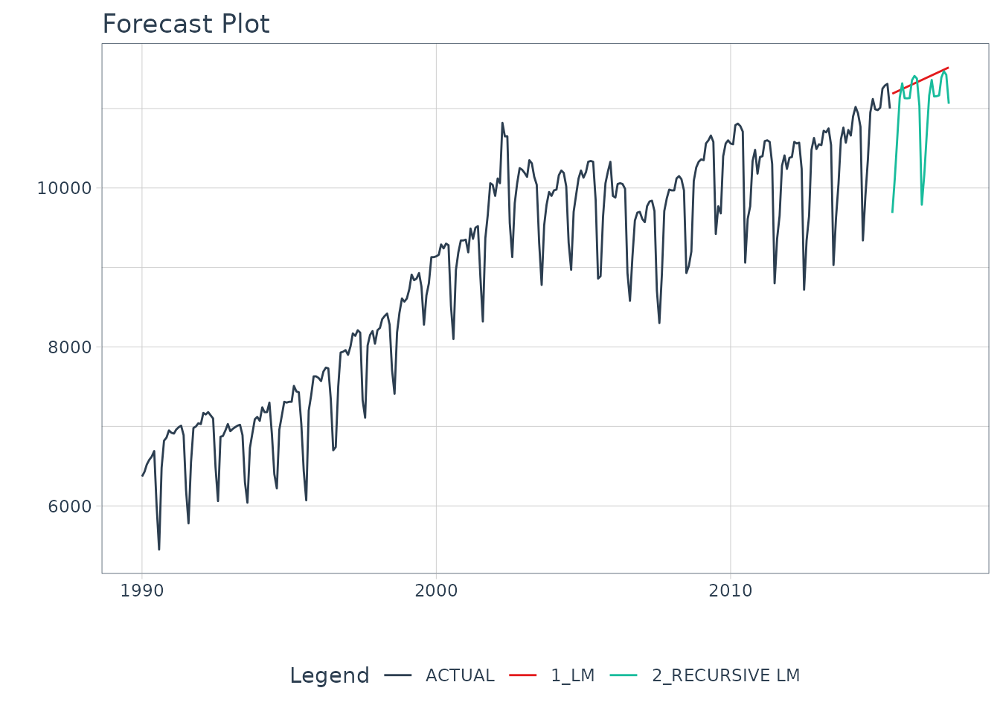
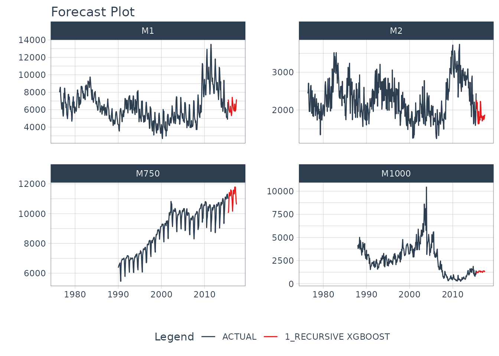

# Autoregressive Forecasting with Recursive

> Turn any `tidymodel` into an Autoregressive Forecasting Model

This short tutorial shows how you can use
[`recursive()`](https://business-science.github.io/modeltime/reference/recursive.md)
to:

- **Make a Recursive Forecast Model** for forecasting with short-term
  lags (i.e. Lag Size \< Forecast Horizon).

- **Perform Recursive Panel Forecasting**, which is when you have a
  single autoregressive model that predicts forecasts for multiple time
  series.


Recursive Panel Forecast with XGBoost

**Forecasting with Recursive Ensembles**

We have a separate `modeltime.ensemble` package that includes support
for
[`recursive()`](https://business-science.github.io/modeltime/reference/recursive.md).
Making recursive ensembles is covered in the [“Forecasting with
Recursive Ensembles”
article](https://business-science.github.io/modeltime.ensemble/articles/recursive-ensembles.html).

## What is a Recursive Model?

A *recursive model* uses predictions to generate new values for
independent features. These features are typically lags used in
autoregressive models.

## Why is Recursive needed for Autoregressive Models?

It’s important to understand that a recursive model is only needed when
using lagged features with a **Lag Size \< Forecast Horizon.** When the
lag length is less than the forecast horizon, a problem exists were
missing values (`NA`) are generated in the future data.

A solution that
[`recursive()`](https://business-science.github.io/modeltime/reference/recursive.md)
implements is to iteratively fill these missing values in with values
generated from predictions. This technique can be used for:

1.  **Single time series predictions** - Effectively turning any
    `tidymodels` model into an Autoregressive (AR) model

2.  **Panel time series predictions** - In many situations we need to
    forecast more than one time series. We can batch-process these with
    1 model by processing time series groups as panels. This technique
    can be extended to recursive forecasting for scalable models (1
    model that predicts many time series).

## Libraries

Load the following libraries.

``` r
library(modeltime)
library(tidymodels)
library(tidyverse)
library(timetk)
```

## Make a Recursive Forecast Model

We’ll start with the simplest example, turning a Linear Regresion into
an Autoregressive model.

### Data Visualization

Let’s start with the `m750` dataset.

``` r
m750
#> # A tibble: 306 × 3
#>    id    date       value
#>    <fct> <date>     <dbl>
#>  1 M750  1990-01-01  6370
#>  2 M750  1990-02-01  6430
#>  3 M750  1990-03-01  6520
#>  4 M750  1990-04-01  6580
#>  5 M750  1990-05-01  6620
#>  6 M750  1990-06-01  6690
#>  7 M750  1990-07-01  6000
#>  8 M750  1990-08-01  5450
#>  9 M750  1990-09-01  6480
#> 10 M750  1990-10-01  6820
#> # ℹ 296 more rows
```

We can visualize the data with
[`plot_time_series()`](https://business-science.github.io/timetk/reference/plot_time_series.html).

``` r
m750 %>% 
  plot_time_series(
    .date_var    = date,
    .value       = value,
    .facet_var   = id,
    .smooth      = FALSE,
    .interactive = FALSE
  )
```


### Data Preparation

Let’s establish a forecast horizon and extend the dataset to create a
forecast region.

``` r
FORECAST_HORIZON <- 24

m750_extended <- m750 %>%
    group_by(id) %>%
    future_frame(
        .length_out = FORECAST_HORIZON,
        .bind_data  = TRUE
    ) %>%
    ungroup()
```

### Transform Function

We’ll use **short-term lags**, lags with a size that are smaller than
the forecast horizon. Here we create a custom function,
`lag_roll_transformer()` that takes a dataset and adds lags 1 through 12
and a rolling mean using lag 12. Each of the features this function use
lags less than our forecast horizon of 24 months, which means we need to
use
[`recursive()`](https://business-science.github.io/modeltime/reference/recursive.md).

``` r
lag_roll_transformer <- function(data){
    data %>%
        tk_augment_lags(value, .lags = 1:FORECAST_HORIZON) %>%
        tk_augment_slidify(
          contains("lag12"),
          .f = ~mean(.x, na.rm = TRUE),
          .period  = 12,
          .partial = TRUE
        ) 
}
```

### Apply the Transform Function

When we apply the lag roll transformation to our extended data set, we
can see the effect.

``` r
m750_rolling <- m750_extended %>%
    lag_roll_transformer() %>%
    select(-id)

m750_rolling
#> # A tibble: 330 × 27
#>    date       value value_lag1 value_lag2 value_lag3 value_lag4 value_lag5
#>    <date>     <dbl>      <dbl>      <dbl>      <dbl>      <dbl>      <dbl>
#>  1 1990-01-01  6370         NA         NA         NA         NA         NA
#>  2 1990-02-01  6430       6370         NA         NA         NA         NA
#>  3 1990-03-01  6520       6430       6370         NA         NA         NA
#>  4 1990-04-01  6580       6520       6430       6370         NA         NA
#>  5 1990-05-01  6620       6580       6520       6430       6370         NA
#>  6 1990-06-01  6690       6620       6580       6520       6430       6370
#>  7 1990-07-01  6000       6690       6620       6580       6520       6430
#>  8 1990-08-01  5450       6000       6690       6620       6580       6520
#>  9 1990-09-01  6480       5450       6000       6690       6620       6580
#> 10 1990-10-01  6820       6480       5450       6000       6690       6620
#> # ℹ 320 more rows
#> # ℹ 20 more variables: value_lag6 <dbl>, value_lag7 <dbl>, value_lag8 <dbl>,
#> #   value_lag9 <dbl>, value_lag10 <dbl>, value_lag11 <dbl>, value_lag12 <dbl>,
#> #   value_lag13 <dbl>, value_lag14 <dbl>, value_lag15 <dbl>, value_lag16 <dbl>,
#> #   value_lag17 <dbl>, value_lag18 <dbl>, value_lag19 <dbl>, value_lag20 <dbl>,
#> #   value_lag21 <dbl>, value_lag22 <dbl>, value_lag23 <dbl>, value_lag24 <dbl>,
#> #   value_lag12_roll_12 <dbl>
```

### Split into Training and Future Data

The **training data** needs to be completely filled in. We remove any
rows with `NA`.

``` r
train_data <- m750_rolling %>%
    drop_na()

train_data
#> # A tibble: 282 × 27
#>    date       value value_lag1 value_lag2 value_lag3 value_lag4 value_lag5
#>    <date>     <dbl>      <dbl>      <dbl>      <dbl>      <dbl>      <dbl>
#>  1 1992-01-01  7030       7040       7000       6980       6550       5780
#>  2 1992-02-01  7170       7030       7040       7000       6980       6550
#>  3 1992-03-01  7150       7170       7030       7040       7000       6980
#>  4 1992-04-01  7180       7150       7170       7030       7040       7000
#>  5 1992-05-01  7140       7180       7150       7170       7030       7040
#>  6 1992-06-01  7100       7140       7180       7150       7170       7030
#>  7 1992-07-01  6490       7100       7140       7180       7150       7170
#>  8 1992-08-01  6060       6490       7100       7140       7180       7150
#>  9 1992-09-01  6870       6060       6490       7100       7140       7180
#> 10 1992-10-01  6880       6870       6060       6490       7100       7140
#> # ℹ 272 more rows
#> # ℹ 20 more variables: value_lag6 <dbl>, value_lag7 <dbl>, value_lag8 <dbl>,
#> #   value_lag9 <dbl>, value_lag10 <dbl>, value_lag11 <dbl>, value_lag12 <dbl>,
#> #   value_lag13 <dbl>, value_lag14 <dbl>, value_lag15 <dbl>, value_lag16 <dbl>,
#> #   value_lag17 <dbl>, value_lag18 <dbl>, value_lag19 <dbl>, value_lag20 <dbl>,
#> #   value_lag21 <dbl>, value_lag22 <dbl>, value_lag23 <dbl>, value_lag24 <dbl>,
#> #   value_lag12_roll_12 <dbl>
```

The **future data** has missing values in the “value” column. We isolate
these. Our autoregressive algorithm will predict these. Notice that the
lags have missing data, this is OK - and why we are going to use
[`recursive()`](https://business-science.github.io/modeltime/reference/recursive.md)
to fill these missing values in with predictions.

``` r
future_data <- m750_rolling %>%
    filter(is.na(value))

future_data
#> # A tibble: 24 × 27
#>    date       value value_lag1 value_lag2 value_lag3 value_lag4 value_lag5
#>    <date>     <dbl>      <dbl>      <dbl>      <dbl>      <dbl>      <dbl>
#>  1 2015-07-01    NA      11000      11310      11290      11250      11010
#>  2 2015-08-01    NA         NA      11000      11310      11290      11250
#>  3 2015-09-01    NA         NA         NA      11000      11310      11290
#>  4 2015-10-01    NA         NA         NA         NA      11000      11310
#>  5 2015-11-01    NA         NA         NA         NA         NA      11000
#>  6 2015-12-01    NA         NA         NA         NA         NA         NA
#>  7 2016-01-01    NA         NA         NA         NA         NA         NA
#>  8 2016-02-01    NA         NA         NA         NA         NA         NA
#>  9 2016-03-01    NA         NA         NA         NA         NA         NA
#> 10 2016-04-01    NA         NA         NA         NA         NA         NA
#> # ℹ 14 more rows
#> # ℹ 20 more variables: value_lag6 <dbl>, value_lag7 <dbl>, value_lag8 <dbl>,
#> #   value_lag9 <dbl>, value_lag10 <dbl>, value_lag11 <dbl>, value_lag12 <dbl>,
#> #   value_lag13 <dbl>, value_lag14 <dbl>, value_lag15 <dbl>, value_lag16 <dbl>,
#> #   value_lag17 <dbl>, value_lag18 <dbl>, value_lag19 <dbl>, value_lag20 <dbl>,
#> #   value_lag21 <dbl>, value_lag22 <dbl>, value_lag23 <dbl>, value_lag24 <dbl>,
#> #   value_lag12_roll_12 <dbl>
```

### Modeling

We’ll make 2 models for comparison purposes:

1.  **Straight-Line Forecast Model** using Linear Regression with the
    Date feature
2.  **Autoregressive Forecast Model** using Linear Regression with the
    Date feature, Lags 1-12, and Rolling Mean Lag 12

#### Model 1 (Baseline): Straight-Line Forecast Model

A straight-line forecast is just to illustrate the effect of no
autoregressive features. Consider this a NAIVE modeling approach. The
only feature that is used as a dependent variable is the “date” column.

``` r
model_fit_lm <- linear_reg() %>%
    set_engine("lm") %>%
    fit(value ~ date, data = train_data)

model_fit_lm
#> parsnip model object
#> 
#> 
#> Call:
#> stats::lm(formula = value ~ date, data = data)
#> 
#> Coefficients:
#> (Intercept)         date  
#>   3356.7208       0.4712
```

#### Model 2: Autoregressive Forecast Model

The autoregressive forecast model is simply a `parsnip` model with one
additional step: using
[`recursive()`](https://business-science.github.io/modeltime/reference/recursive.md).
The key components are:

- `transform`: A transformation function. We use the function previously
  made that generated Lags 1 to 12 and the Rolling Mean Lag 12 features.

- `train_tail`: The tail of the training data, which must be as large as
  the lags used in the transform function (i.e. lag 12).

  - Train tail can be larger than the lag size used. Notice that we use
    the Forecast Horizon, which is size 24.
  - For Panel Data, we need to include the tail for each group. We have
    provided a convenient
    [`panel_tail()`](https://business-science.github.io/modeltime/reference/panel_tail.md)
    function.

- `id` (Optional): This is used to identify groups for Recursive Panel
  Data.

``` r
# Autoregressive Forecast
model_fit_lm_recursive <- linear_reg() %>%
    set_engine("lm") %>%
    fit(value ~ ., data = train_data) %>%
    # One additional step - use recursive()
    recursive(
        transform  = lag_roll_transformer,
        train_tail = tail(train_data, FORECAST_HORIZON)
    )

model_fit_lm_recursive
#> Recursive [parsnip model]
#> 
#> parsnip model object
#> 
#> 
#> Call:
#> stats::lm(formula = value ~ ., data = data)
#> 
#> Coefficients:
#>         (Intercept)                 date           value_lag1  
#>           164.14732              0.00677              0.61244  
#>          value_lag2           value_lag3           value_lag4  
#>             0.18402             -0.07128              0.12089  
#>          value_lag5           value_lag6           value_lag7  
#>            -0.01750              0.07095              0.09785  
#>          value_lag8           value_lag9          value_lag10  
#>            -0.08053              0.04887              0.03030  
#>         value_lag11          value_lag12          value_lag13  
#>            -0.01755              0.73318             -0.52958  
#>         value_lag14          value_lag15          value_lag16  
#>            -0.21410              0.07734             -0.13879  
#>         value_lag17          value_lag18          value_lag19  
#>             0.04351             -0.08894             -0.08732  
#>         value_lag20          value_lag21          value_lag22  
#>             0.06641             -0.05737             -0.02331  
#>         value_lag23          value_lag24  value_lag12_roll_12  
#>             0.05754              0.15960                   NA
```

### Modeltime Forecasting Workflow

Once we have our fitted model, we can follow the [Modeltime
Workflow](https://business-science.github.io/modeltime/articles/getting-started-with-modeltime.html)
(note we are skipping calibration and refitting, but this can be
performed to get confidence intervals):

First, we add fitted models to a **Model Table** using
[`modeltime_table()`](https://business-science.github.io/modeltime/reference/modeltime_table.md).
(Note - If your model description says “LM”, install the development
version of `modeltime`, which has improved model descriptions for
recursive models).

``` r
model_tbl <- modeltime_table(
    model_fit_lm,
    model_fit_lm_recursive
) 

model_tbl
#> # Modeltime Table
#> # A tibble: 2 × 3
#>   .model_id .model   .model_desc 
#>       <int> <list>   <chr>       
#> 1         1 <fit[+]> LM          
#> 2         2 <fit[+]> RECURSIVE LM
```

Next, we perform **Forecast Evaluation** using
[`modeltime_forecast()`](https://business-science.github.io/modeltime/reference/modeltime_forecast.md)
and
[`plot_modeltime_forecast()`](https://business-science.github.io/modeltime/reference/plot_modeltime_forecast.md).

``` r
model_tbl %>% 
  
    # Forecast using future data
    modeltime_forecast(
        new_data    = future_data,
        actual_data = m750
    ) %>%
  
    # Visualize the forecast
    plot_modeltime_forecast(
        .interactive        = FALSE,
        .conf_interval_show = FALSE
    )
```



We can see the benefit of autoregressive features.

## Recursive Forecasting with Panel Models

We can take this further by extending what we’ve learned here to panel
data:

**Panel Data:**

- Grouped transformation functions: `lag_roll_transformer_grouped()`
- [`recursive()`](https://business-science.github.io/modeltime/reference/recursive.md):
  Using `id` and the
  [`panel_tail()`](https://business-science.github.io/modeltime/reference/panel_tail.md)
  function

**More sophisticated algorithms:**

- Instead of using a simple Linear Regression
- We use `xgboost` to forecast multiple time series

### Data Visualization

Now we have 4 time series that we will forecast.

``` r
m4_monthly %>%  
  plot_time_series(
    .date_var    = date, 
    .value       = value, 
    .facet_var   = id, 
    .facet_ncol  = 2,
    .smooth      = FALSE, 
    .interactive = FALSE
)
```


### Data Preparation

We use
[`timetk::future_frame()`](https://business-science.github.io/timetk/reference/future_frame.html)
to project each series forward by the forecast horizon. This sets up an
extended data set with each series extended by 24 time stamps.

``` r
FORECAST_HORIZON <- 24

m4_extended <- m4_monthly %>%
    group_by(id) %>%
    future_frame(
        .length_out = FORECAST_HORIZON,
        .bind_data  = TRUE
    ) %>%
    ungroup()
```

### Transform Function

The only difference is that we are applying any lags by group.

``` r
lag_roll_transformer_grouped <- function(data){
    data %>%
        group_by(id) %>%
        tk_augment_lags(value, .lags = 1:FORECAST_HORIZON) %>%
        tk_augment_slidify(
          .value   = contains("lag12"),
          .f       = ~mean(.x, na.rm = T),
          .period  = c(12),
          .partial = TRUE
        ) %>%
        ungroup()
}
```

### Apply the Transform Function

We apply the groupwise lag transformation to the extended data set. This
adds autoregressive features.

``` r
m4_lags <- m4_extended %>%
    lag_roll_transformer_grouped()

m4_lags
#> # A tibble: 1,670 × 28
#>    id    date       value value_lag1 value_lag2 value_lag3 value_lag4 value_lag5
#>    <fct> <date>     <dbl>      <dbl>      <dbl>      <dbl>      <dbl>      <dbl>
#>  1 M1    1976-06-01  8000         NA         NA         NA         NA         NA
#>  2 M1    1976-07-01  8350       8000         NA         NA         NA         NA
#>  3 M1    1976-08-01  8570       8350       8000         NA         NA         NA
#>  4 M1    1976-09-01  7700       8570       8350       8000         NA         NA
#>  5 M1    1976-10-01  7080       7700       8570       8350       8000         NA
#>  6 M1    1976-11-01  6520       7080       7700       8570       8350       8000
#>  7 M1    1976-12-01  6070       6520       7080       7700       8570       8350
#>  8 M1    1977-01-01  6650       6070       6520       7080       7700       8570
#>  9 M1    1977-02-01  6830       6650       6070       6520       7080       7700
#> 10 M1    1977-03-01  5710       6830       6650       6070       6520       7080
#> # ℹ 1,660 more rows
#> # ℹ 20 more variables: value_lag6 <dbl>, value_lag7 <dbl>, value_lag8 <dbl>,
#> #   value_lag9 <dbl>, value_lag10 <dbl>, value_lag11 <dbl>, value_lag12 <dbl>,
#> #   value_lag13 <dbl>, value_lag14 <dbl>, value_lag15 <dbl>, value_lag16 <dbl>,
#> #   value_lag17 <dbl>, value_lag18 <dbl>, value_lag19 <dbl>, value_lag20 <dbl>,
#> #   value_lag21 <dbl>, value_lag22 <dbl>, value_lag23 <dbl>, value_lag24 <dbl>,
#> #   value_lag12_roll_12 <dbl>
```

### Split into Training and Future Data

Just like the single case, we split into future and training data.

``` r
train_data <- m4_lags %>%
    drop_na()

future_data <- m4_lags %>%
    filter(is.na(value))
```

### Modeling

We’ll use a more sophisticated algorithm `xgboost` to develop an
autoregressive model.

``` r
# Modeling Autoregressive Panel Data
set.seed(123)
model_fit_xgb_recursive <- boost_tree(
        mode = "regression",
        learn_rate = 0.35
    ) %>%
    set_engine("xgboost") %>%
    fit(
        value ~ . 
        + month(date, label = TRUE) 
        + as.numeric(date) 
        - date, 
        data = train_data
    ) %>%
    recursive(
        id         = "id", # We add an id = "id" to specify the groups
        transform  = lag_roll_transformer_grouped,
        # We use panel_tail() to grab tail by groups
        train_tail = panel_tail(train_data, id, FORECAST_HORIZON)
    )

model_fit_xgb_recursive
#> Recursive [parsnip model]
#> 
#> parsnip model object
#> 
#> ##### xgb.Booster
#> call:
#>   xgboost::xgb.train(params = list(eta = 0.35, max_depth = 6, gamma = 0, 
#>     colsample_bytree = 1, colsample_bynode = 1, min_child_weight = 1, 
#>     subsample = 1, nthread = 1, objective = "reg:squarederror"), 
#>     data = x$data, nrounds = 15, evals = x$watchlist, verbose = 0)
#> # of features: 41 
#> # of rounds:  15 
#> callbacks:
#>    evaluation_log 
#> evaluation_log:
#>   iter training_rmse
#>  <int>         <num>
#>      1     2020.6031
#>      2     1363.6807
#>    ---           ---
#>     14      185.7499
#>     15      178.4500
```

### Modeltime Forecasting Workflow

First, create a Modeltime Table. Note - If your model description says
“XGBOOST”, install the development version of `modeltime`, which has
improved model descriptions for recursive models).

``` r
model_tbl <- modeltime_table(
    model_fit_xgb_recursive
)

model_tbl
#> # Modeltime Table
#> # A tibble: 1 × 3
#>   .model_id .model   .model_desc      
#>       <int> <list>   <chr>            
#> 1         1 <fit[+]> RECURSIVE XGBOOST
```

Next, we can forecast the results.

``` r
model_tbl %>%
    modeltime_forecast(
        new_data    = future_data,
        actual_data = m4_monthly,
        keep_data   = TRUE
    ) %>%
    group_by(id) %>%
    plot_modeltime_forecast(
        .interactive        = FALSE,
        .conf_interval_show = FALSE,
        .facet_ncol         = 2
    )
```



### Summary

We just showcased Recursive Forecasting. But this is a simple problem.
And, there’s a lot more to learning time series.

- Many more algorithms
- Ensembling
- Machine Learning
- Deep Learning
- Scalable Modeling: 10,000+ time series

Your probably thinking how am I ever going to learn time series
forecasting. Here’s the solution that will save you years of struggling.

### Take the High-Performance Forecasting Course

> Become the forecasting expert for your organization

[](https://university.business-science.io/p/ds4b-203-r-high-performance-time-series-forecasting/)

[*High-Performance Time Series
Course*](https://university.business-science.io/p/ds4b-203-r-high-performance-time-series-forecasting/)

#### Time Series is Changing

Time series is changing. **Businesses now need 10,000+ time series
forecasts every day.** This is what I call a *High-Performance Time
Series Forecasting System (HPTSF)* - Accurate, Robust, and Scalable
Forecasting.

**High-Performance Forecasting Systems will save companies by improving
accuracy and scalability.** Imagine what will happen to your career if
you can provide your organization a “High-Performance Time Series
Forecasting System” (HPTSF System).

#### How to Learn High-Performance Time Series Forecasting

I teach how to build a HPTFS System in my [**High-Performance Time
Series Forecasting
Course**](https://university.business-science.io/p/ds4b-203-r-high-performance-time-series-forecasting).
You will learn:

- **Time Series Machine Learning** (cutting-edge) with `Modeltime` - 30+
  Models (Prophet, ARIMA, XGBoost, Random Forest, & many more)
- **Deep Learning** with `GluonTS` (Competition Winners)
- **Time Series Preprocessing**, Noise Reduction, & Anomaly Detection
- **Feature engineering** using lagged variables & external regressors
- **Hyperparameter Tuning**
- **Time series cross-validation**
- **Ensembling** Multiple Machine Learning & Univariate Modeling
  Techniques (Competition Winner)
- **Scalable Forecasting** - Forecast 1000+ time series in parallel
- and more.

Become the Time Series Expert for your organization.

  

[Take the High-Performance Time Series Forecasting
Course](https://university.business-science.io/p/ds4b-203-r-high-performance-time-series-forecasting)
