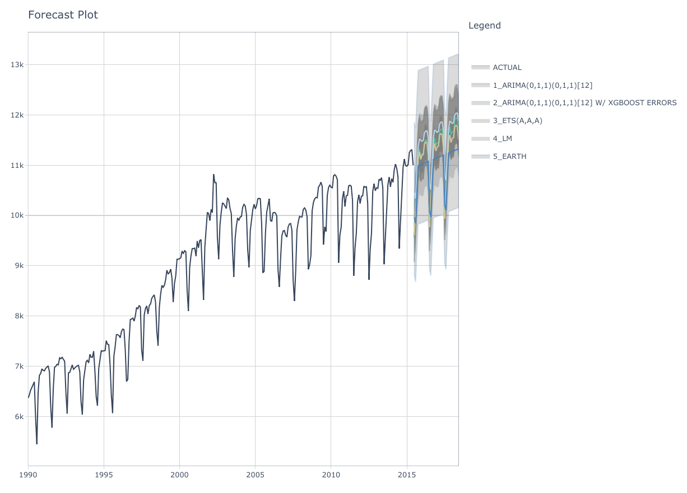
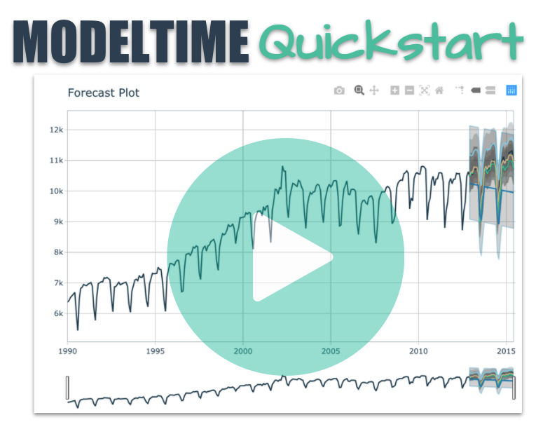

```{r, include = FALSE}
knitr::opts_chunk$set(
  collapse = TRUE,
  comment = "#>",
  
  out.width='100%',
  fig.align = "center",
  fig.width = 7,
  fig.height = 5,
  
  message = FALSE,
  warning = FALSE
)
```


```{r, echo=F,  out.width="100%", fig.align='center'}

```
<br>


Forecasting with `tidymodels` made easy! This short tutorial shows how you can use:

- __Modeltime models__ like `arima_reg()`, `arima_boost()`, `exp_smoothing()`, `prophet_reg()`, `prophet_boost()`, and more
- __Parsnip models__ like `linear_reg()`, `mars()`, `svm_rbf()`, `rand_forest()`, `boost_tree()` and more

...to perform classical time series analysis and machine learning ___in one framework!___  See [_"Model List"_](https://business-science.github.io/modeltime/articles/modeltime-model-list.html) for the full list of `modeltime` models. 

## Quickstart Video

For those that prefer video tutorials, we have an [11-minute YouTube Video](https://www.youtube.com/watch?v=-bCelif-ENY) that walks you through the Modeltime Workflow. 

<a href="https://www.youtube.com/watch?v=-bCelif-ENY" target="_blank">
<p style='text-align:center;'>

</p>
<p style='text-align:center'>(Click to Watch on YouTube)</p>
</a>


## The Modeltime Workflow

Here's the general process and where the functions fit. 

```{r, echo=F,  out.width="100%", fig.align='center', fig.cap="The Modeltime Workflow"}
knitr::include_graphics("modeltime_workflow.jpg")
```

Just follow the `modeltime` workflow, which is detailed in 6 convenient steps:

1. Collect data and split into training and test sets
2. Create & Fit Multiple Models
3. Add fitted models to a __Model Table__
4. __Calibrate__ the models to a testing set.
5. Perform Testing Set _Forecast_ & _Accuracy_ Evaluation
6. __Refit__ the models to Full Dataset & _Forecast_ Forward

Let's go through a guided tour to kick the tires on `modeltime`. 

## Time Series Forecasting Example

Load libraries to complete this short tutorial.

```r
library(xgboost)
library(tidymodels)
library(modeltime)
library(tidyverse)
library(timetk)

# This toggles plots from plotly (interactive) to ggplot (static)
interactive <- FALSE
```

```{r, include=FALSE}
library(xgboost)
library(tidymodels)
library(modeltime)
library(dplyr)
library(lubridate)
library(timetk)

# This toggles plots from plotly (interactive) to ggplot (static)
interactive <- FALSE
```

### Step 1 - Collect data and split into training and test sets. 

```{r}
# Data
m750 <- m4_monthly %>% filter(id == "M750")
```

We can visualize the dataset. 

```{r}
m750 %>%
  plot_time_series(date, value, .interactive = interactive)
```


Let's split the data into training and test sets using `initial_time_split()`

```{r}
# Split Data 80/20
splits <- initial_time_split(m750, prop = 0.9)
```


### Step 2 - Create & Fit Multiple Models

We can easily create dozens of forecasting models by combining `modeltime` and `parsnip`. We can also use the `workflows` interface for adding preprocessing! Your forecasting possibilities are endless. Let's get a few basic models developed:

- ARIMA
- Exponential Smoothing
- Linear Regression
- MARS (Multivariate Adaptive Regression Splines)


__Important note: Handling Date Features__

_Modeltime models_ (e.g. `arima_reg()`) are created with a date or date time feature in the model. You will see that most models include a formula like `fit(value ~ date, data)`. 

_Parsnip models_ (e.g. `linear_reg()`) typically should not have date features, but may contain derivatives of dates (e.g. month, year, etc). You will often see formulas like `fit(value ~ as.numeric(date) + month(date), data)`.

#### Model 1: Auto ARIMA (Modeltime)

First, we create a basic univariate ARIMA model using "Auto Arima" using `arima_reg()`

```{r, message=TRUE}
# Model 1: auto_arima ----
model_fit_arima_no_boost <- arima_reg() %>%
    set_engine(engine = "auto_arima") %>%
    fit(value ~ date, data = training(splits))
```

#### Model 2: Boosted Auto ARIMA (Modeltime)

Next, we create a boosted ARIMA using `arima_boost()`. Boosting uses XGBoost to model the ARIMA errors. Note that model formula contains both a date feature and derivatives of date
 - ARIMA uses the date
 - XGBoost uses the derivatives of date as regressors
 
Normally I'd use a preprocessing workflow for the month features using a function like `step_timeseries_signature()` from `timetk` to help reduce the complexity of the parsnip formula interface. 

```{r, message=TRUE}
# Model 2: arima_boost ----
model_fit_arima_boosted <- arima_boost(
    min_n = 2,
    learn_rate = 0.015
) %>%
    set_engine(engine = "auto_arima_xgboost") %>%
    fit(value ~ date + as.numeric(date) + factor(month(date, label = TRUE), ordered = F),
        data = training(splits))
```


#### Model 3: Exponential Smoothing (Modeltime)

Next, create an Error-Trend-Season (ETS) model using an Exponential Smoothing State Space model. This is accomplished with `exp_smoothing()`.

```{r, message=TRUE}
# Model 3: ets ----
model_fit_ets <- exp_smoothing() %>%
    set_engine(engine = "ets") %>%
    fit(value ~ date, data = training(splits))
```

#### Model 4: Prophet (Modeltime)

We'll create a `prophet` model using `prophet_reg()`.

```{r, message=TRUE}
# Model 4: prophet ----
model_fit_prophet <- prophet_reg() %>%
    set_engine(engine = "prophet") %>%
    fit(value ~ date, data = training(splits))
```

#### Model 5: Linear Regression (Parsnip)

We can model time series linear regression (TSLM) using the `linear_reg()` algorithm from `parsnip`. The following derivatives of date are used:

- _Trend:_ Modeled using `as.numeric(date)`
- _Seasonal:_ Modeled using `month(date)`

```{r, message=TRUE}
# Model 5: lm ----
model_fit_lm <- linear_reg() %>%
    set_engine("lm") %>%
    fit(value ~ as.numeric(date) + factor(month(date, label = TRUE), ordered = FALSE),
        data = training(splits))
```

#### Model 6: MARS (Workflow)

We can model a Multivariate Adaptive Regression Spline model using `mars()`. I've modified the process to use a `workflow` to standardize the preprocessing of the features that are provided to the machine learning model (mars). 

```{r, message=TRUE}
# Model 6: earth ----

model_spec_mars <- mars(mode = "regression") %>%
    set_engine("earth") 

recipe_spec <- recipe(value ~ date, data = training(splits)) %>%
    step_date(date, features = "month", ordinal = FALSE) %>%
    step_mutate(date_num = as.numeric(date)) %>%
    step_normalize(date_num) %>%
    step_rm(date)
  
wflw_fit_mars <- workflow() %>%
    add_recipe(recipe_spec) %>%
    add_model(model_spec_mars) %>%
    fit(training(splits))
```

OK, with these 6 models, we'll show how easy it is to forecast. 

### Step 3 - Add fitted models to a Model Table. 

The next step is to add each of the models to a Modeltime Table using `modeltime_table()`. This step does some basic checking to make sure each of the models are fitted and that organizes into a scalable structure called a ___"Modeltime Table"___ that is used as part of our _forecasting workflow._

We have 6 models to add. A couple of notes before moving on:

- Note that some of the models have _tunable parameters_. 
- It's expected that tuning and parameter selection is performed prior to incorporating into a Modeltime Table. 
- If you try to add an unfitted model, the `modeltime_table()` will complain (throw an informative error) saying you need to `fit()` the model. 

```{r, paged.print = FALSE}
models_tbl <- modeltime_table(
    model_fit_arima_no_boost,
    model_fit_arima_boosted,
    model_fit_ets,
    model_fit_prophet,
    model_fit_lm,
    wflw_fit_mars
)

models_tbl
```

### Step 4 - Calibrate the model to a testing set. 

Calibrating adds a new column, `.calibration_data`, with the test predictions and residuals inside. A few notes on Calibration:

- Calibration is how confidence intervals and accuracy metrics are determined 
- ___Calibration Data___ is simply forecasting predictions and residuals that are calculated from out-of-sample data.
- After calibrating, the calibration data follows the data through the forecasting workflow. 

```{r, paged.print = FALSE}
calibration_tbl <- models_tbl %>%
    modeltime_calibrate(new_data = testing(splits))

calibration_tbl
```

### Step 5 - Testing Set Forecast & Accuracy Evaluation

There are 2 critical parts to an evaluation.

- Visualizing the Forecast vs Test Data Set
- Evaluating the Test (Out of Sample) Accuracy

#### 5A - Visualizing the Forecast Test

Visualizing the Test Error is easy to do using the __interactive plotly visualization (just toggle the visibility of the models using the Legend).__ 

```{r}
calibration_tbl %>%
    modeltime_forecast(
        new_data    = testing(splits),
        actual_data = m750
    ) %>%
    plot_modeltime_forecast(
      .legend_max_width = 25, # For mobile screens
      .interactive      = interactive
    )
```

From visualizing the test set forecast:

- __Models 1&2: ARIMA & ARIMA Boost__ are performing well. Both models have "auto" components because we used Auto ARIMA. The XGBoost component has parameters that were specified. We can possibly get better accuracy by tuning, but because the ARIMA component is working well on this data, additional improvement may be low. 
- __Model 3: ETS(M,A,A)__ is performing the best. The 80% confidence interval is the most narrow of the bunch, indicating the hold out set is modeled well. 
- __Model 4: PROPHET__ is comparable to the ARIMA models, but has a slightly wider test error confidence interval. 
- __Model 5: LM__ is over-shooting the local trend. This is because the trend component is a simple linear line, which doesn't account for the change points. 
- __Model 6: EARTH__ is overfitting the local trend. This is because we did not tune the number of change points, so the algorithm is auto-calculating the change points. 

#### 5B - Accuracy Metrics

We can use `modeltime_accuracy()` to collect common accuracy metrics. The default reports the following metrics using `yardstick` functions:

- __MAE__ - Mean absolute error, `mae()`
- __MAPE__ - Mean absolute percentage error, `mape()`
- __MASE__ - Mean absolute scaled error, `mase()`
- __SMAPE__ - Symmetric mean absolute percentage error, `smape()`
- __RMSE__ - Root mean squared error, `rmse()`
- __RSQ__ - R-squared, `rsq()`

These of course can be customized following the rules for creating new yardstick metrics, but the defaults are very useful. Refer to `default_forecast_accuracy_metrics()` to learn more.

To make table-creation a bit easier, I've included `table_modeltime_accuracy()` for outputing results in either interactive (`reactable`) or static (`gt`) tables. 

```{r}
calibration_tbl %>%
    modeltime_accuracy() %>%
    table_modeltime_accuracy(
        .interactive = interactive
    )
```

From the accuracy metrics:

- __Model 3: ETS is clearly the winner here with MAE of 77__
- __Model 6: MARS__ is over-fitting the local trend. This comes out in the R-Squared of 0.55. 

### Step 6 - Refit to Full Dataset & Forecast Forward

The final step is to refit the models to the full dataset using `modeltime_refit()` and forecast them forward. 

```{r, paged.print = F, message=F}
refit_tbl <- calibration_tbl %>%
    modeltime_refit(data = m750)

refit_tbl %>%
    modeltime_forecast(h = "3 years", actual_data = m750) %>%
    plot_modeltime_forecast(
      .legend_max_width = 25, # For mobile screens
      .interactive      = interactive
    )
```

## Refitting - What happened? 

__The models have all changed!__ (Yes - this is the point of refitting)

- The __LM__ model looks much better now because the linear trend line has now been fit to new data that follows the longer term trend. 
- The __EARTH__ model has a trend that is more representative of the near-term trend.
- The __PROPHET__ model has a trend that is very similar to the EARTH model (this is because both modeling algorithms use changepoints to model trend, and prophet's auto algorithm seems to be doing a better job at adapting).
- The __ETS__ model has changed from (M,A,A) to (A,A,A).
- The __ARIMA__ model have been updated and better capture the upswing. 

__This is the (potential) benefit of refitting.__ 

More often than not refitting is a good idea. Refitting:

- Retrieves your model and preprocessing steps
- Refits the model to the new data
- Recalculates any automations. This includes:
    - Recalculating the long-term trend for Linear Model
    - Recalculating the changepoints for the Earth Model
    - Recalculating the ARIMA and ETS parameters
- Preserves any parameter selections. This includes:
    - XGBoost Parameters in the Boosted ARIMA `min_n = 2`, `learn_rate = 0.015`.
    - Any other defaults that are not automatic calculations are used.

## Summary

We just showcased the Modeltime Workflow. But this is a simple problem. And, there's a lot more to learning time series. 

- Many more algorithms
- Ensembling
- Machine Learning
- Deep Learning
- Scalable Modeling: 10,000+ time series

Your probably thinking how am I ever going to learn time series forecasting. Here's the solution that will save you years of struggling. 

## Take the High-Performance Forecasting Course

> Become the forecasting expert for your organization

<a href="https://university.business-science.io/p/ds4b-203-r-high-performance-time-series-forecasting/" target="_blank"></a>

[_High-Performance Time Series Course_](https://university.business-science.io/p/ds4b-203-r-high-performance-time-series-forecasting/)

### Time Series is Changing

Time series is changing. __Businesses now need 10,000+ time series forecasts every day.__ This is what I call a _High-Performance Time Series Forecasting System (HPTSF)_ - Accurate, Robust, and Scalable Forecasting. 

 __High-Performance Forecasting Systems will save companies by improving accuracy and scalability.__ Imagine what will happen to your career if you can provide your organization a "High-Performance Time Series Forecasting System" (HPTSF System).

### How to Learn High-Performance Time Series Forecasting

I teach how to build a HPTFS System in my [__High-Performance Time Series Forecasting Course__](https://university.business-science.io/p/ds4b-203-r-high-performance-time-series-forecasting). You will learn:

- __Time Series Machine Learning__ (cutting-edge) with `Modeltime` - 30+ Models (Prophet, ARIMA, XGBoost, Random Forest, & many more)
- __Deep Learning__ with `GluonTS` (Competition Winners)
- __Time Series Preprocessing__, Noise Reduction, & Anomaly Detection
- __Feature engineering__ using lagged variables & external regressors
- __Hyperparameter Tuning__
- __Time series cross-validation__
- __Ensembling__ Multiple Machine Learning & Univariate Modeling Techniques (Competition Winner)
- __Scalable Forecasting__ - Forecast 1000+ time series in parallel
- and more.

<p class="text-center" style="font-size:24px;">
Become the Time Series Expert for your organization.
</p>
<br>
<p class="text-center" style="font-size:30px;">
<a href="https://university.business-science.io/p/ds4b-203-r-high-performance-time-series-forecasting">Take the High-Performance Time Series Forecasting Course</a>
</p>


