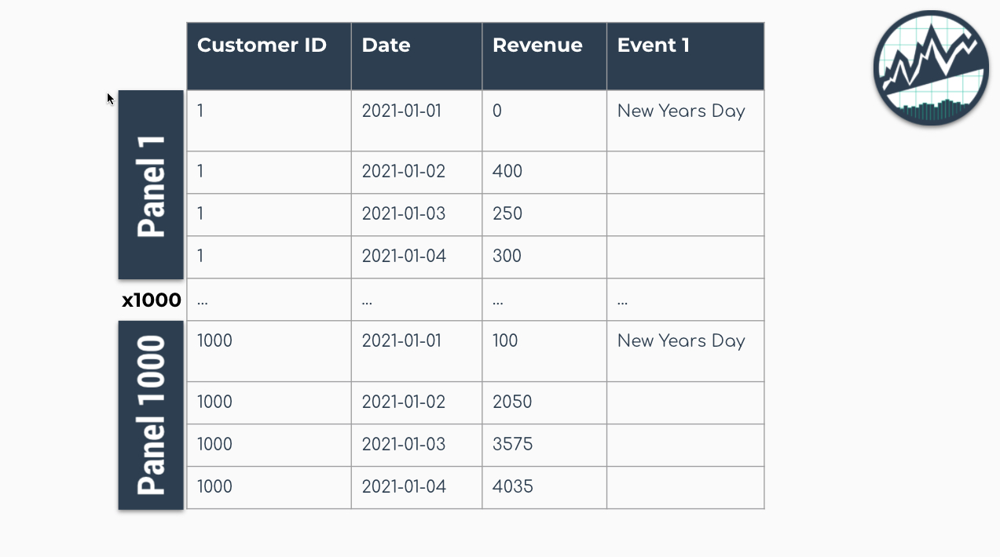

```{r, include = FALSE}
knitr::opts_chunk$set(
  collapse = TRUE,
  comment = "#>",
  
  out.width='100%',
  fig.align = "center",
  fig.width = 7,
  fig.height = 5,
  
  message = FALSE,
  warning = FALSE
)
```


```{r, echo=F,  out.width="100%", fig.align='center'}
knitr::include_graphics("panel_data_success.jpg")
```

<br>


__Why is global modeling important for time series?__ For starters, the ability to forecast many time series with a single model that is trained on many time series groups was a winning strategy in recent Kaggle M5 Forecasting Competition. In fact, it's the solution we recommend in our [Time Series Course](https://university.business-science.io/p/ds4b-203-r-high-performance-time-series-forecasting/) when forecasting many time series as part of a high-performance forecasting system. Why? Because it speeds up forecasting, allowing the data scientist to more rapidly experiment and find good solutions. 

# Global Forecasting

In general, there are two methods for forecasting at scale (a slow and accurate method and a fast and good method):

1. __Iterative Forecasting (Slow and Accurate):__ Best for accuracy but takes _much longer_ than global model (due to for-loop iteration), results in many models (more memory required), and is often needed to be run in parallel to scale to thousands of time series (otherwise it can take days to complete). But, iterative forecasting can yield great results. See [Nested Forecasting](https://business-science.github.io/modeltime/articles/nested-forecasting.html) for our Iterative Forecasting implementation.

2. __Global Modeling (Fast and Good):__ Best for scalability to thousands of time series. Uses a Panel Data structure. Can scale to 10,000+ time series easily because only a single model is made that generates predictions (forecasts) for all of the time series. Requires feature engineering and parameter tuning to get best performance, which can be challenging for beginners.  


# Important Concepts

Students can struggle with global modeling. To help, I have a few terms to cover that will help you understand how global modeling works (and how it differs from iterative modeling).

## Panel Data

__The panel data structure__ is the format used for global modeling. In it's simplest form, _Panel Data_ is a time series dataset that has more than one series. Each time series is stacked row-wise (on-top) of each other. 

```{r, echo=F, fig.cap="Panel Data Structure"}

```

## Traditional Modeling (Iteration)

__Traditional modeling techniques like ARIMA__ can only be used on one time series at a time. The widely accepted forecasting approach is to iterate through each time series producing a unique model and forecast for each time series identifier. The downside with this approach is that it's expensive when you have many time series. Think of the number of products in a database. As the number of time series approaches the range of 1000-10,000, __the iterative approach becomes unscalable.__ 

```{r, echo=F, fig.cap="Problem: 1000 ARIMA Models Needed for 1000 Time Series"}
knitr::include_graphics("panel_data_arima.jpg")
```

## Global Modeling

__Global Models__ are alternatives to the iterative approach. A Global Model is a single model that forecasts all time series at once. Global Models are highly scalable, which solves the problem of 1-10,000 time series. An example is an XGBoost Model, which can determine relationships for all 1000 time series panels with a single model. 

```{r, echo=F, fig.cap="Solution: A Single XGBOOST Model can Model 1000 Time Series"}
knitr::include_graphics("panel_data_xgboost.jpg")
```

## Importance of Feature Engineering

The downside is that an global approach can be less accurate. To improve accuracy, __feature engineering and localized model selection__ by time series identifier become critical to large-scale forecasting success. We recommend learning feature engineering techniques that are proven to get results in our [Time Series Forecasting Course](https://university.business-science.io/p/ds4b-203-r-high-performance-time-series-forecasting/). 

```{r, echo=F, fig.cap="Modeling Panel Data"}
knitr::include_graphics("panel_data_success.jpg")
```


# Getting Started

We'll cover a short tutorial on global forecasting. The first thing to do is to load the following libraries:


```{r}
library(tidymodels)
library(modeltime)
library(timetk)
```

```r
library(tidyverse)
```

```{r, echo=FALSE, message=FALSE}
library(dplyr)
```


## Dataset

Next, let's use the `walmart_sales_weekly` dataset that comes with `timetk`. 

```{r}
data_tbl <- walmart_sales_weekly %>%
    select(id, date = Date, value = Weekly_Sales)

data_tbl
```

The dataset is that is already set up for panel data modeling. The important columns are:

- "id": This separates the time series groups (in this case these represent sales from departments in a walmart store)

- "date": This is the weekly sales period

- "value": This is the value for sales during the week and store/department

We can visualize this by time series group to expose the differences in sales by department. 

```{r}
data_tbl %>%
  group_by(id) %>%
  plot_time_series(
    date, value, .interactive = F, .facet_ncol = 2
  )
```

We can clearly see that there are 7 time series groups with different weekly sales patterns. 

## Train/Test Splitting

We can split the data into training and testing sets using `time_series_split()`. We'll investigate the last 3-months of the year to test a global model on a 3-month forecast. The message on overlapping dates is to let us know that multiple time series are being processed using the last 3-month window for testing. 

```{r, message=TRUE}
splits <- data_tbl %>% 
  time_series_split(
    assess     = "3 months", 
    cumulative = TRUE
  )

splits
```

## Recipe

__Next, we need to preprocess the data.__ This is where we add good features to imporve our global model performance. We will use the `recipes` workflow for generating time series features. 

- `step_mutate_at()`: Applies a function to one or more columns. Used to remove extra unused levels in our categorical ID column. 

- `step_timeseries_signature()`: Used to add calendar features based on our date column

- `step_rm()`: Used to remove the date column. Machine Learning algorithms like XGBoost don't handle date columns very well.

- `step_zv()`: Used to remove any zero variance features. Features with no variance don't add useful information to our model. 

- `step_dummy()`: Used to convert categorical features to binary one-hot encoded features that algorithms like XGBoost can model more effectively.

This results in 37 derived features for modeling. We can certainly include more features such as lags and rolling features that are known to improve results. These concepts and more are covered in the [High-Performance Time Series Course](https://university.business-science.io/p/ds4b-203-r-high-performance-time-series-forecasting/).

```{r}
rec_obj <- recipe(value ~ ., training(splits)) %>%
    step_mutate_at(id, fn = droplevels) %>%
    step_timeseries_signature(date) %>%
    step_rm(date) %>%
    step_zv(all_predictors()) %>%
    step_dummy(all_nominal_predictors(), one_hot = TRUE)

summary(prep(rec_obj))
```

## Machine Learning 

We'll create an `xgboost` workflow by fitting the default xgboost model to our derived features from our in-sample training data set. 

- Training the global xgboost model takes approximately 50 milliseconds. 

- Conversely, an ARIMA model might take several minutes to iterate through possible parameter combinations for each of the 7 time series. 

```{r}
# Workflow
wflw_xgb <- workflow() %>%
    add_model(
        boost_tree("regression") %>% set_engine("xgboost")
    ) %>%
    add_recipe(rec_obj) %>%
    fit(training(splits))

wflw_xgb
```

## Modeltime Workflow

We'll step through the modeltime workflow, which is used to test many different models on the time series and organize the entire process. 

```{r, echo=F, fig.cap="Modeltime Workflow"}
knitr::include_graphics("modeltime_workflow.jpg")
```

### Step 1: Create a Modeltime Table

The first step is to create a Modeltime Table with `modeltime_table()`.

```{r}
model_tbl <- modeltime_table(
    wflw_xgb
)

model_tbl
```

### Step 2: Calibrate by ID

Next, we need to calibrate, which calculates the forecast error on our test set. Use `modeltime_calibrate()` to perform calibration.  Note that when we add the `id`, we are able to track the the out-of-sample residual error by the "id" column. 

```{r}
calib_tbl <- model_tbl %>%
    modeltime_calibrate(
      new_data = testing(splits), 
      id       = "id"
    )

calib_tbl
```

### Step 3: Measure Test Accuracy

Next, we measure the global and local accuracy on the global model. 

#### Global Accuracy

The default is `modeltime_accuracy(acc_by_id = FALSE)`, which returns a global model accuracy. 

```{r}
calib_tbl %>% 
    modeltime_accuracy(acc_by_id = FALSE) %>% 
    table_modeltime_accuracy(.interactive = FALSE)
```

#### Local Accuracy

By toggling `modeltime_accuracy(acc_by_id = TRUE)`, we can obtain the local model accuracy. This can be useful for identifying specifically which time series the model does well on (and which it does poorly on). We can then __apply model selection logic__ to select specific global models for specific IDs. 

```{r}
calib_tbl %>% 
    modeltime_accuracy(acc_by_id = TRUE) %>% 
    table_modeltime_accuracy(.interactive = FALSE)
```

### Step 4: Forecast the Test Data

Next, we need to forecast the test dataset. This is useful to evaluate the model using a sampling of the time series within the panel dataset. We use `modeltime_forecast(conf_by_id  = TRUE)` to allow the confidence intervals (prediction intervals) to be calculated by time series identifier. Note, that the `modeltime_calibrate()` must have been performed with an `id` specified. 

```{r}
calib_tbl %>%
    modeltime_forecast(
        new_data    = testing(splits),
        actual_data = data_tbl,
        conf_by_id  = TRUE
    ) %>%
    group_by(id) %>%
    plot_modeltime_forecast(
        .facet_ncol  = 3,
        .interactive = FALSE
    )
```

### Step 5: Refit and Forecast the Future

We see that our global model performs well on this dataset. Now, we will forecast the future. 

#### Refit the Models

The refitting step is needed to incorporate the most recent information into our models. We use `modeltime_refit()` to update the model(s) in our modeltime tables. 

```{r}
refit_tbl <- calib_tbl %>%
  modeltime_refit(data = data_tbl)

refit_tbl
```


#### Future Data

Next, make a future dataset using `future_frame()` from `timetk`, which creates future time stamps that extend 52-weeks into the future for each ID in the same panel structure needed for our global forecast model. 

```{r}
future_tbl <- data_tbl %>%
  group_by(id) %>%
  future_frame(.length_out = 52, .bind_data = FALSE)

future_tbl
```


#### Future Predictions

Finally, we can forecast the future using our future data. 

```{r}
refit_tbl %>%
  modeltime_forecast(
    new_data    = future_tbl,
    actual_data = data_tbl, 
    conf_by_id  = TRUE
  ) %>%
  group_by(id) %>%
  plot_modeltime_forecast(
    .interactive = F,
    .facet_ncol  = 2
  )
```


# Summary

We've now successfully completed a __Global Forecast.__ You may find this challenging, especially if you are not familiar with the Modeltime Workflow, terminology, or tidymodeling in R. If this is the case, we have a solution. Take our high-performance forecasting course. 


## Take the High-Performance Forecasting Course

> Become the forecasting expert for your organization

<a href="https://university.business-science.io/p/ds4b-203-r-high-performance-time-series-forecasting/" target="_blank"></a>

[_High-Performance Time Series Course_](https://university.business-science.io/p/ds4b-203-r-high-performance-time-series-forecasting/)

### Time Series is Changing

Time series is changing. __Businesses now need 10,000+ time series forecasts every day.__ This is what I call a _High-Performance Time Series Forecasting System (HPTSF)_ - Accurate, Robust, and Scalable Forecasting. 

 __High-Performance Forecasting Systems will save companies by improving accuracy and scalability.__ Imagine what will happen to your career if you can provide your organization a "High-Performance Time Series Forecasting System" (HPTSF System).

### How to Learn High-Performance Time Series Forecasting

I teach how to build a HPTFS System in my [__High-Performance Time Series Forecasting Course__](https://university.business-science.io/p/ds4b-203-r-high-performance-time-series-forecasting). You will learn:

- __Time Series Machine Learning__ (cutting-edge) with `Modeltime` - 30+ Models (Prophet, ARIMA, XGBoost, Random Forest, & many more)
- __Deep Learning__ with `GluonTS` (Competition Winners)
- __Time Series Preprocessing__, Noise Reduction, & Anomaly Detection
- __Feature engineering__ using lagged variables & external regressors
- __Hyperparameter Tuning__
- __Time series cross-validation__
- __Ensembling__ Multiple Machine Learning & Univariate Modeling Techniques (Competition Winner)
- __Scalable Forecasting__ - Forecast 1000+ time series in parallel
- and more.

<p class="text-center" style="font-size:24px;">
Become the Time Series Expert for your organization.
</p>
<br>
<p class="text-center" style="font-size:30px;">
<a href="https://university.business-science.io/p/ds4b-203-r-high-performance-time-series-forecasting">Take the High-Performance Time Series Forecasting Course</a>
</p>


