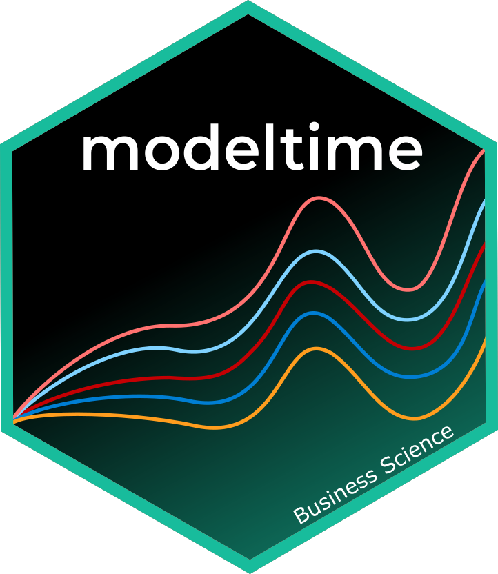
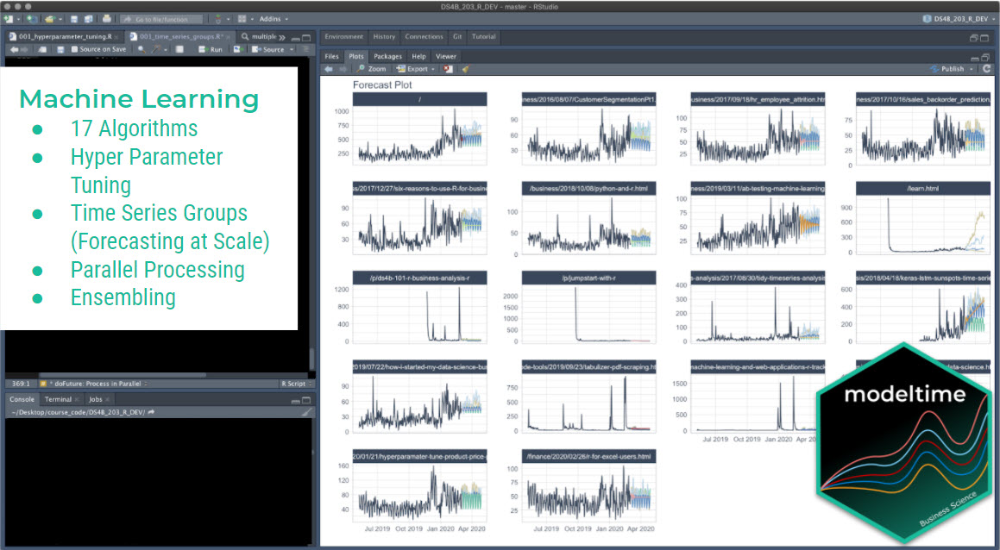

```{r, include = FALSE}
knitr::opts_chunk$set(
  collapse = TRUE,
  comment = "#>",
  
  out.width='100%',
  fig.align = "center",
  fig.width = 7,
  fig.height = 5,
  
  message = FALSE,
  warning = FALSE
)
```




Modeltime integrates Conformal Prediction Intervals as part of its time series forecasting workflow. This tutorial showcases 2 methods for Conformal Prediction Intervals:


1. **Conformal Default Method:** Uses `qnorm()` to compute quantiles from out-of-sample (test set) residuals.

2. **Conformal Split Method** Uses the split method split conformal inference method described by Lei et al (2018)


## Time Series Conformal Forecasting Prediction Interval Tutorial

Load libraries to complete this short tutorial.

```r
library(tidyverse)
```

```{r}
library(tidymodels)
library(modeltime)
library(timetk)

# This toggles plots from plotly (interactive) to ggplot (static)
interactive <- FALSE
```

```{r, include=FALSE}
library(dplyr)
```


### Step 1 - Collect data and split into training, test, and future data sets. 

We'll start with the Walmart Sales data set from `timetk`. 

```{r}
# Data

walmart_sales_tbl <- timetk::walmart_sales_weekly %>%
    select(id, Date, Weekly_Sales) %>%
    mutate(id = forcats::as_factor(id))
```

We can visualize the data set. 

```{r}
walmart_sales_tbl %>%
    group_by(id) %>%
    plot_time_series(
        Date, Weekly_Sales,
        .facet_ncol  = 2,
        .interactive = interactive,
    )
```


Let's split the data into training and test sets using `time_series_split()`

```{r}
# Split Data 80/20
splits <- time_series_split(
    walmart_sales_tbl,
    assess     = "1 year",
    cumulative = TRUE
)

splits
```

Finally, let's make a future dataset that will be used to forecast the next 1 year. 

```{r}
new_data_tbl <- walmart_sales_tbl %>%
    group_by(id) %>%
    future_frame(.length_out = "1 year") %>%
    ungroup()
```


### Step 2 - Create & Fit Forecasting Models

We'll set up an XGBoost forecasting model for this tutorial. 

#### Recipe

First, let's create a recipe. This step creates a number of time series features and one-hot encodes any categorical features. 

```{r}
recipe_ml <- recipe(Weekly_Sales ~ ., training(splits)) %>%
    step_timeseries_signature(Date) %>%
    step_rm(Date) %>%
    step_dummy(all_nominal_predictors(), one_hot = TRUE)

recipe_ml
```

#### Model & Workflow

Next, let's create the model and fit the recipe and model on the training dataset. 

```{r}
model_xgb <- boost_tree("regression") %>%
    set_engine("xgboost")

wflw_fit_xgb <- workflow() %>%
    add_model(model_xgb) %>%
    add_recipe(recipe_ml) %>%
    fit(training(splits))

wflw_fit_xgb
```


### Step 3 - Add fitted models to a Model Table. 

The next step is to add model(s) to a modeltime table. This step stores the model in a data frame for organizational purposes. 

```{r, paged.print = FALSE}
models_tbl <- modeltime_table(
     wflw_fit_xgb
)

models_tbl
```

### Step 4 - Calibrate the model to a testing set. 

Next, we calibrate the model using the testing set. Note- I'm using the `id = "id"` which allows us to track confidence for each time series group in our dataset. The column "id" is used as the grouping column. 

```{r, paged.print = FALSE}
calibration_tbl <- models_tbl %>%
    modeltime_calibrate(
        new_data = testing(splits), 
        id       = "id"
    )

calibration_tbl
```

## Conformal Prediction

With the calibration table in hand, we can now implement the conformal prediction interval. Currently, there are 2 methods implemented in `modeltime_forecast`:

1. `conformal_default`: Uses `qnorm()` to compute quantiles from out-of-sample (test set) residuals.

2. `conformal_split`: Uses the split method split conformal inference method described by Lei et al (2018)

### Conformal Default Method

The default method has been implemented in modeltime from the start of the `modeltime` package. 

* This method uses `qnorm()` to produce a 95% confidence interval by default. It estimates a normal (Gaussian distribution) based on the out-of-sample errors (residuals).

* The confidence interval is mean-adjusted, meaning that if the mean of the residuals is non-zero, the confidence interval is adjusted to widen the interval to capture the difference in means.

Here we implement a 95% confidence interval meaning 95% of the test data will fall within the boundaries. The `tail()` function is used to show the .conf_lo and .conf_hi probabilistic prediction intervals.  

```{r, paged.print = FALSE}
forecast_tbl <- calibration_tbl %>%
    modeltime_forecast(
        new_data      = testing(splits),
        actual_data   = walmart_sales_tbl,
        conf_interval = 0.95,
        conf_method   = "conformal_default", # Default Conformal Method
        conf_by_id    = TRUE, # TRUE = local CI by ID, FALSE = global CI
        keep_data     = TRUE
    )

# Last 7 data points for (1 for each time series)
forecast_tbl %>% tail(7)
```
We can visualize the probability intervals for the Conformal Default method. 

```{r, fig.height=7}
forecast_tbl %>%
    group_by(id) %>%
    plot_modeltime_forecast(
        .facet_ncol  = 2, 
        .interactive = interactive,
        .title       = "Conformal Default"
    )
```

### Conformal Split Method

When `conf_method = "conformal_split`, this method uses the split conformal inference method described by Lei et al (2018). This is also implemented in the `probably` R package's `int_conformal_split()` function.

```{r, paged.print = FALSE}
forecast_tbl <- calibration_tbl %>%
    modeltime_forecast(
        new_data      = testing(splits),
        actual_data   = walmart_sales_tbl,
        conf_interval = 0.95,
        conf_method   = "conformal_split", # Split Conformal Method
        conf_by_id    = TRUE, # TRUE = local CI by ID, FALSE = global CI
        keep_data     = TRUE
    )

# Last 7 data points for (1 for each time series)
forecast_tbl %>% tail(7)
```

We can visualize the probability intervals for the Conformal Split method. 

```{r, fig.height=7}
forecast_tbl %>%
    group_by(id) %>%
    plot_modeltime_forecast(
        .facet_ncol  = 2, 
        .interactive = interactive,
        .title       = "Conformal Split"
    )
```

## Refit and Future Forecast

Many Conformal Prediction tutorials fail to show how to make the future forecast for data that has not happened yet. I aim to fix this. Using the following code, we can quickly refit the model and make the future forecast applying the conformal probabilities to the future forecast estimates.

```{r}
refit_tbl <- calibration_tbl %>%
    modeltime_refit(walmart_sales_tbl)

forecast_future_tbl <- refit_tbl %>%
    modeltime_forecast(
        new_data      = new_data_tbl,
        actual_data   = walmart_sales_tbl,
        conf_interval = 0.95,
        conf_method   = "conformal_split", # Split Conformal Method
        conf_by_id    = TRUE, # TRUE = local CI by ID, FALSE = global CI
        keep_data     = TRUE
    )
```

With the future forecast, we can visualize both the point estimates and the 95% conformal probability region.

```{r, fig.height=7}
forecast_future_tbl %>%
    group_by(id) %>%
    plot_modeltime_forecast(
        .facet_ncol  = 2, 
        .interactive = interactive,
        .title       = "Conformal Split"
    )
```


## Summary

You have just seen how to do a simple Conformal Prediction estimate for a global time series model. But this is a simple problem. And, there's a lot more to learning time series. 

- Many more algorithms
- Ensembling
- Machine Learning
- Deep Learning
- Iterative Forecasting
- Scalable Modeling: 10,000+ time series

Your probably thinking how am I ever going to learn time series forecasting. Here's the solution that will save you years of struggling. 

## Take the High-Performance Forecasting Course

> Become the forecasting expert for your organization

<a href="https://university.business-science.io/p/ds4b-203-r-high-performance-time-series-forecasting/" target="_blank"></a>

[_High-Performance Time Series Course_](https://university.business-science.io/p/ds4b-203-r-high-performance-time-series-forecasting/)

### Time Series is Changing

Time series is changing. __Businesses now need 10,000+ time series forecasts every day.__ This is what I call a _High-Performance Time Series Forecasting System (HPTSF)_ - Accurate, Robust, and Scalable Forecasting. 

 __High-Performance Forecasting Systems will save companies by improving accuracy and scalability.__ Imagine what will happen to your career if you can provide your organization a "High-Performance Time Series Forecasting System" (HPTSF System).

### How to Learn High-Performance Time Series Forecasting

I teach how to build a HPTFS System in my [__High-Performance Time Series Forecasting Course__](https://university.business-science.io/p/ds4b-203-r-high-performance-time-series-forecasting). You will learn:

- __Time Series Machine Learning__ (cutting-edge) with `Modeltime` - 30+ Models (Prophet, ARIMA, XGBoost, Random Forest, & many more)
- __Deep Learning__ with `GluonTS` (Competition Winners)
- __Time Series Preprocessing__, Noise Reduction, & Anomaly Detection
- __Feature engineering__ using lagged variables & external regressors
- __Hyperparameter Tuning__
- __Time series cross-validation__
- __Ensembling__ Multiple Machine Learning & Univariate Modeling Techniques (Competition Winner)
- __Scalable Forecasting__ - Forecast 1000+ time series in parallel
- and more.

<p class="text-center" style="font-size:24px;">
Become the Time Series Expert for your organization.
</p>
<br>
<p class="text-center" style="font-size:30px;">
<a href="https://university.business-science.io/p/ds4b-203-r-high-performance-time-series-forecasting">Take the High-Performance Time Series Forecasting Course</a>
</p>


