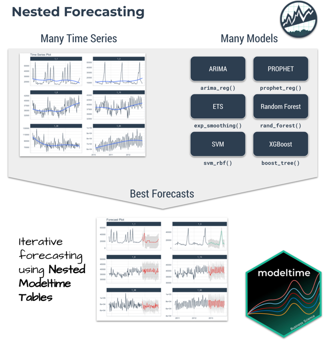
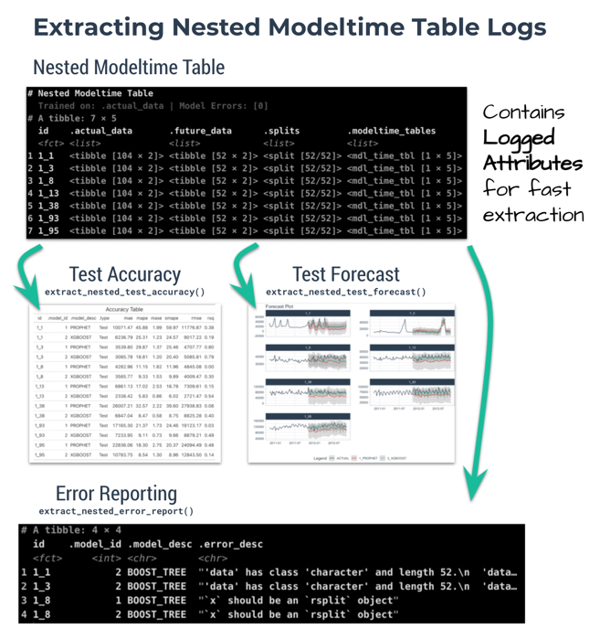
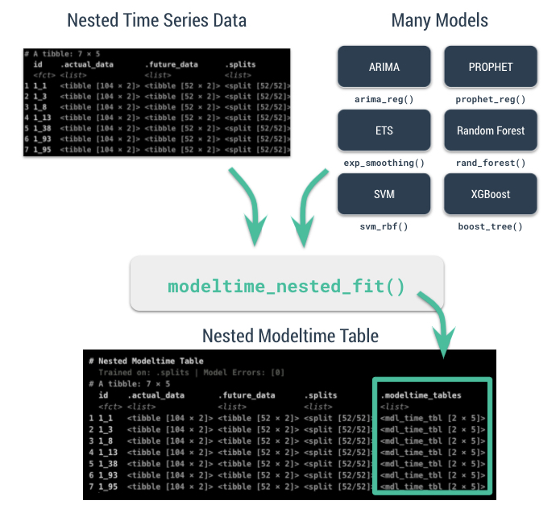
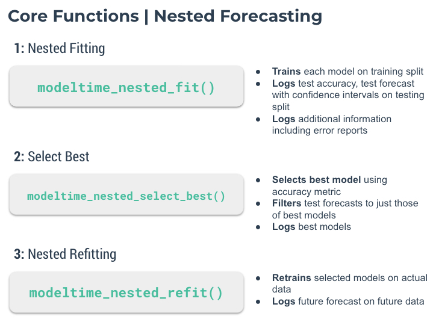

```{r, include = FALSE}
knitr::opts_chunk$set(
  collapse = TRUE,
  comment = "#>",
  
  out.width='100%',
  fig.align = "center",
  fig.width = 7,
  fig.height = 5,
  
  message = FALSE,
  warning = FALSE
)
```

> Iteratively forecast with nested modeling

__Why is nested forecasting important?__ For starters, the ability to _iteratively forecast_ time series with many models that are trained on many individual groups has been a huge request from students in our [Time Series Course](https://university.business-science.io/p/ds4b-203-r-high-performance-time-series-forecasting/). Why? Because two methods exist that get results: 

1. __Global Modeling:__ Best for scalability using a Global Models and a Panel Data structure. See [Forecasting with Global Models](https://business-science.github.io/modeltime/articles/modeling-panel-data.html). 

2. __Iterative Forecasting:__ Best for accuracy using a Nested Data Structure. Takes longer than global model (more resources due to for-loop iteration), but can yield great results. 

We've incorporated a new approach called ___"nested forecasting"___ to help perform _Iterative Forecasting_. 

## Nested Forecasting

The core idea of __nested forecasting__ is to convert a dataset containing __many time series groups__ into a nested data set, then fit __many models__ to each of the nested datasets. The result is an iterative forecasting process that generates Nested Modeltime Tables with all of the forecast attributes needed to make decisions. 

```{r, echo=F,  out.width="80%", fig.align='center'}

```


## Important Concepts: Logging & Attributes

A new feature to nested forecasting workflow is __logged attributes__, which is very useful in complex workflows where loops (iteration) is performed. In a _Nested Modeltime Table_, we push as many operations as possible into the fitting and refitting stages, logging important aspects including:

- __Test Accuracy:__ `extract_nested_test_accuracy()`
- __Test Forecast:__ `extract_nested_test_forecast()`
- __Error Reports:__ `extract_nested_error_report()`
- __Best Models:__ `extract_nested_best_model_report()`
- __Future Forecasts:__ `extract_nested_future_forecast()`

While this deviates from the traditional Modeltime Workflow, we find that __logging vastly speeds up experimentation and information retrieval__ especially when the number of time series increases. 

```{r, echo=F,  out.width="80%", fig.align='center'}

```


## Getting Started

We'll go through a short tutorial on __Nested Forecasting.__ The first thing to do is to load the following libraries:

```r
library(modeltime)
library(tidymodels)
library(tidyverse)
library(timetk)
```

```{r, echo = FALSE}
library(modeltime)
library(tidymodels)
library(dplyr)
library(timetk)
```


### Dataset

Next, let's use the `walmart_sales_weekly` dataset that comes with `timetk`. 

```{r}
data_tbl <- walmart_sales_weekly %>%
    select(id, date = Date, value = Weekly_Sales)

data_tbl
```

The problem with this dataset is that it's set up for panel data modeling. The important columns are:

- "id": This separates the time series groups (in this case these represent sales from departments in a walmart store)

- "date": This is the weekly sales period

- "value": This is the value for sales during the week and store/department

We can visualize this by time series group to expose the differences in sales by department. 

```{r}
data_tbl %>%
  group_by(id) %>%
  plot_time_series(
    date, value, .interactive = FALSE, .facet_ncol = 2
  )
```

We can clearly see that there are 7 time series groups with different weekly sales patterns. 

### Nested Forecasting Preparation

There are two key components that we need to prepare for:

1. __Nested Data Structure:__ Most critical to ensure your data is prepared (covered next)

2. __Nested Modeltime Workflow:__ This stage is where we create many models, fit the models to the data, and generate forecasts at scale

Conceptually, the workflow looks like this where we combine nested data and tidymodels workflows using an upcoming function, `modeltime_nested_fit()`. 

```{r, echo=F,  out.width="80%", fig.align='center'}

```

## Data Preparation

The most critical stage in __"Nested Forecasting"__ is data preparation, making sure that the input to the nested forecasting workflow is in the appropriate structure. We've included several functions to help that involve a bit of forethought that can be broken into 3 steps:

1. __Extending each of the times series:__ How far into the future do you need to predict for each time series? See `extend_timeseries()`.

2. __Nesting by the grouping variable:__ This is where you create the nested structure. You'll identify the ID column that separates each time series, and the number of timestamps to include in the ".future_data" and optionally ".actual_data". Typically, you'll select the same `.length_future` as your extension from the previous step. See `nest_timeseries()`.

3. __Train/Test Set Splitting:__ Finally, you'll take your `.actual_data` and convert into train/test splits that can be used for accuracy and confidence interval estimation. See `split_nested_timeseries()`.

Here are the 3-steps in action:

```{r}
nested_data_tbl <- data_tbl %>%
    
    # 1. Extending: We'll predict 52 weeks into the future.
    extend_timeseries(
        .id_var        = id,
        .date_var      = date,
        .length_future = 52
    ) %>%
    
    # 2. Nesting: We'll group by id, and create a future dataset
    #    that forecasts 52 weeks of extended data and
    #    an actual dataset that contains 104 weeks (2-years of data)
    nest_timeseries(
        .id_var        = id,
        .length_future = 52,
        .length_actual = 52*2
    ) %>%
    
   # 3. Splitting: We'll take the actual data and create splits
   #    for accuracy and confidence interval estimation of 52 weeks (test)
   #    and the rest is training data
    split_nested_timeseries(
        .length_test = 52
    )

nested_data_tbl
```

This creates a nested tibble with ".actual_data", ".future_data", and ".splits". Each column will help in the nested modeltime workflow. 

## Nested Modeltime Workflow


Next, we move into the __Nested Modeltime Workflow__ now that nested data has been created. The Nested Modeltime Workflow includes 3 core functions:

1. __Modeling Fitting:__ This is the training stage where we fit to _training data_. The _test forecast_ is generated from this step. See `modeltime_nested_fit()`.

2. __Model Evaluation and Selection:__ This is where we review model performance and select the best model by minimizing or maximizing an error metric. See `modeltime_nested_select_best()`.

3. __Model Refitting:__ This is the final fitting stage where we fit to _actual data_. The _future forecast_ is generated from this step. See `modeltime_nested_refit()`.

```{r, echo=F,  out.width="80%", fig.align='center'}

```

### Step 1: Create Tidymodels Workflows

First, we create `tidymodels` workflows for the various models that you intend to create.

#### Prophet

A common modeling method is prophet, that can be created using `prophet_reg()`. We'll create a workflow. Note that we use the `extract_nested_train_split(nested_data_tbl)` to help us build preprocessing features.

```{r}
rec_prophet <- recipe(value ~ date, extract_nested_train_split(nested_data_tbl)) 

wflw_prophet <- workflow() %>%
    add_model(
      prophet_reg("regression", seasonality_yearly = TRUE) %>% 
        set_engine("prophet")
    ) %>%
    add_recipe(rec_prophet)
```


#### XGBoost

Next, we can use a machine learning method that can get good results: XGBoost. We will add a few extra features in the recipe feature engineering step to generate features that tend to get better modeling results. Note that we use the `extract_nested_train_split(nested_data_tbl)` to help us build preprocessing features.

```{r}
rec_xgb <- recipe(value ~ ., extract_nested_train_split(nested_data_tbl)) %>%
    step_timeseries_signature(date) %>%
    step_rm(date) %>%
    step_zv(all_predictors()) %>%
    step_dummy(all_nominal_predictors(), one_hot = TRUE)

wflw_xgb <- workflow() %>%
    add_model(boost_tree("regression") %>% set_engine("xgboost")) %>%
    add_recipe(rec_xgb)
```


### Step 2: Nested Modeltime Tables

With a couple of modeling workflows in hand, we are now ready to test them on each of the time series. We start by using the `modeltime_nested_fit()` function, which iteratively fits each model to each of the nested time series train/test ".splits" column. 

```{r, message=TRUE}
nested_modeltime_tbl <- modeltime_nested_fit(
  # Nested data 
  nested_data = nested_data_tbl,
  
  # Add workflows
  wflw_prophet,
  wflw_xgb
)

nested_modeltime_tbl
```

This adds a new column with `.modeltime_tables` for each of the data sets and has created several __logged attributes__ that are part of the "Nested Modeltime Table". We also can see that the models were trained on ".splits" and none of the models had any errors. 

### Step 3: Logged Attributes

During the forecasting, the iterative modeltime fitting process logs important information that enable us to evaluate the models. These logged attributes are accessible with "extract" functions. 

#### Extract Nested Test Accuracy

Using the `extract_nested_test_accuracy()`, we can get the accuracy measures by time series and model. This allows us to see which model performs best on which time series. 

```{r}
nested_modeltime_tbl %>% 
  extract_nested_test_accuracy() %>%
  table_modeltime_accuracy(.interactive = F)
```

#### Extract Nested Test Forecast

Next, we can visualize the test forecast with `extract_nested_test_forecast()`.

```{r}
nested_modeltime_tbl %>% 
  extract_nested_test_forecast() %>%
  group_by(id) %>%
  plot_modeltime_forecast(
    .facet_ncol  = 2,
    .interactive = FALSE
  )
```

#### Extract Nested Error Logs

If any of the models have errors, then we can investigate the error logs with `extract_nested_error_report()`. Fortunately, we don't have any errors, but if we did we could investigate further. 

```{r}
nested_modeltime_tbl %>% 
  extract_nested_error_report()
```

### Step 4: Select the Best

Using the accuracy data, we can pick a metric and select the best model based on that metric. The available metrics are in the `default_forecast_accuracy_metric_set()`. Make sure to select `minimize` based on the metric. The `filter_test_forecasts` parameter tells the function to filter the logged test forecasts to just the best. 

```{r}
best_nested_modeltime_tbl <- nested_modeltime_tbl %>%
    modeltime_nested_select_best(
      metric                = "rmse", 
      minimize              = TRUE, 
      filter_test_forecasts = TRUE
    )
```

This identifies which models should be used for the final forecast. With the models selected, we can make the future forecast. 

#### Extract Nested Best Model Report

The best model selections can be accessed with `extract_nested_best_model_report()`.

```{r}
best_nested_modeltime_tbl %>%
  extract_nested_best_model_report()
```


#### Extract Nested Best Test Forecasts

Once we've selected the best models, we can easily visualize the best forecasts by time series. Note that the nested test forecast logs have been modified to isolate the best models. 

```{r}
best_nested_modeltime_tbl %>%
  extract_nested_test_forecast() %>%
  group_by(id) %>%
  plot_modeltime_forecast(
    .facet_ncol  = 2,
    .interactive = FALSE
  )
```


### Step 5: Refitting and Future Forecast

With the best models in hand, we can make our future forecasts by refitting the models to the full dataset. 

- If the best models have been selected, the only the best models will be refit. 

- If best models have not been selected, then all models will be refit.

We've selected our best models, and will move forward with refitting and future forecast logging using the `modeltime_nested_refit()` function. 

```{r, message=TRUE}
nested_modeltime_refit_tbl <- best_nested_modeltime_tbl %>%
    modeltime_nested_refit(
        control = control_nested_refit(verbose = TRUE)
    )
```

Note that we used `control_nested_refit(verbose = TRUE)` to display the modeling results as each model is refit. This is not necessary, but can be useful to follow the nested model fitting process. 

We can see that the nested modeltime table appears the same, but has now been trained on `.actual_data`.  

```{r, message = TRUE}
nested_modeltime_refit_tbl
```

#### Extract Nested Future Forecast

After the refitting process completes, we can now access the future forecast, which is logged.

```{r}
nested_modeltime_refit_tbl %>%
  extract_nested_future_forecast() %>%
  group_by(id) %>%
  plot_modeltime_forecast(
    .interactive = FALSE,
    .facet_ncol  = 2
  )
```

## Summary

We've now successfully completed a __Nested Forecast.__ You may find this challenging, especially if you are not familiar with the Modeltime Workflow, terminology, or tidymodeling in R. If this is the case, we have a solution. Take our high-performance forecasting course. 


## Take the High-Performance Forecasting Course

> Become the forecasting expert for your organization

<a href="https://university.business-science.io/p/ds4b-203-r-high-performance-time-series-forecasting/" target="_blank"></a>

[_High-Performance Time Series Course_](https://university.business-science.io/p/ds4b-203-r-high-performance-time-series-forecasting/)

### Time Series is Changing

Time series is changing. __Businesses now need 10,000+ time series forecasts every day.__ This is what I call a _High-Performance Time Series Forecasting System (HPTSF)_ - Accurate, Robust, and Scalable Forecasting. 

 __High-Performance Forecasting Systems will save companies by improving accuracy and scalability.__ Imagine what will happen to your career if you can provide your organization a "High-Performance Time Series Forecasting System" (HPTSF System).

### How to Learn High-Performance Time Series Forecasting

I teach how to build a HPTFS System in my [__High-Performance Time Series Forecasting Course__](https://university.business-science.io/p/ds4b-203-r-high-performance-time-series-forecasting). You will learn:

- __Time Series Machine Learning__ (cutting-edge) with `Modeltime` - 30+ Models (Prophet, ARIMA, XGBoost, Random Forest, & many more)
- __Deep Learning__ with `GluonTS` (Competition Winners)
- __Time Series Preprocessing__, Noise Reduction, & Anomaly Detection
- __Feature engineering__ using lagged variables & external regressors
- __Hyperparameter Tuning__
- __Time series cross-validation__
- __Ensembling__ Multiple Machine Learning & Univariate Modeling Techniques (Competition Winner)
- __Scalable Forecasting__ - Forecast 1000+ time series in parallel
- and more.

<p class="text-center" style="font-size:24px;">
Become the Time Series Expert for your organization.
</p>
<br>
<p class="text-center" style="font-size:30px;">
<a href="https://university.business-science.io/p/ds4b-203-r-high-performance-time-series-forecasting">Take the High-Performance Time Series Forecasting Course</a>
</p>


